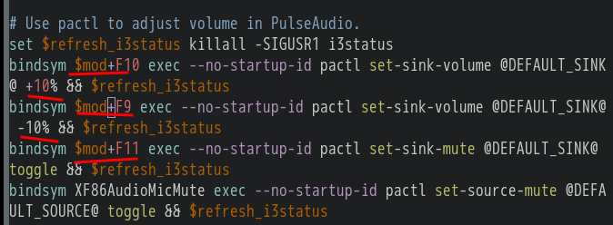
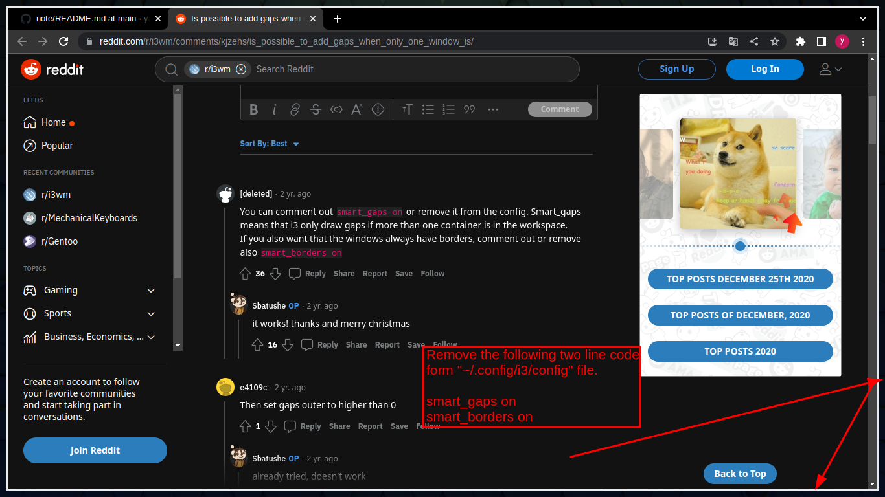
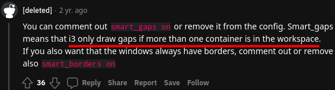

- [[i3]] and [[Vim]] move hotkey
  * `jkl;` //i3 默认移动键
  * `hjkl` //vim 默认移动键
  * ***Notice***
  * `$mod+d` //与 horizontal 热键冲突 (请修改 horizontal 的热键，比如：`$mod+semicolon`)
  * `hjkl` //统一 i3 与 vim 移动键
- [[i3]] [[sound]]
  * 修改前 
  *  
  * 修改后 
  *  
  * ***Notice***
  * `$mod+F10` `+10%` `$mod+F9` `-10%`//音量增加/减少 (请根据你自己电脑的音量键，设置相应的键，你也可以自定义)
  * `mute` `$mod+F11` //静音键 (同上，mute: 沉默的)
  * **`$mod+Shift+r` //重启 i3 (然后按下静音键) (如果没有声音的话)**
- [[Logseq]]上传文件
  * `/Upload an asset` //上传文件 (在 logseq 中输入此命令)
- [[i3]] [[screenshot]]
  * `bindsym Print exec flameshot gui` //开启截图 (如果没有 flameshot 的话，请安装 flameshot)
- ---
- #### Set gaps in i3
  ```
  for_window [class="^.*"] border pixel 6 //隐藏窗口标题栏，并设置窗口边框像素（可以自定义数字）
  gaps inner 5 //相邻 window（窗口）之间的距离
  gaps outer 0 //window（窗口）与屏幕边缘之间的距离
  smart_gaps on //如果 workspace（工作空间）只有一个 window（窗口），将禁用 gaps（间隙）
  ```
- ***Notes***
    - Draw only if more than one container is in the workspace
      ```
      smart_gaps on
      smart_boards on
      ```
- ***References***
    - 
    - 
    - 
    - https://www.reddit.com/r/i3wm/comments/kjzehs/is_possible_to_add_gaps_when_only_one_window_is/
    - https://wiki.gentoo.org/wiki/I3#Configuring_gaps_between_tiled_windows_.28i3-gaps_only.29
- ---
- [[i3]] [[exit]]
  * `bindsym $mod+Shift+e exit` //退出 i3，不用鼠标 (移除 "exec ……" 这个警告，并添加 "exit")
- [[i3]]改变聚焦 (避免与浏览器快捷键冲突，如果你的 $mod 键是alt的话)
  ```
  #bindsym $mod+Left focus left //注释这行
  #bindsym $mod+Down focus down //注释这行
  #bindsym $mod+Up focus up //注释这行
  #bindsym $mod+Right focus right //注释这行
  ```
- [[Vim]]行间移动
  * `10j` //向下10行 (number (数字) + h/j/k/l，你可以自定义)
- [[i3]] [[i3status]] 取消状态栏图标
  * 在行首，添加注释 (i3status 的配置文件) 
  * 
  * ***Notice***
  * `locate i3status` //查找 i3status 的配置文件 (使用 locate 命令)
- ---
- #### Use "locate" to look for a file in Linux
    - `locate filename`
- ***Notes***
    - `doas emerge -aq sys-apps/mlocate` # Install it in Gentoo Linux
    - `doas updatedb` # Update the database before locating
- ***References***
    - https://askubuntu.com/questions/800347/cant-locate-a-directory-using-locate?
- ---
- [[i3]]workspace(工作区)图标
  * 将复制的图标粘贴到如图所示的位置
  *  
  * ***Notice***
  * [免费复制图标网站](https://fontawesome.com/cheatsheet "Cheatsheet - Font Awesome") //`ctrl + c` 即可复制 (如果找不到可以复制的图标的话)
  * 如果没有awesome字体，请安装 ttf-font-awesome
  * ***References***
  * https://www.youtube.com/watch?v=Bw5sDLOvN20&ab_channel=GerryStudios
- 主机快照timeshift(快照可存其他盘，非系统盘) future #Idea
- [[linux]] [[shell]](命令解析器)zsh
  * `chsh -s /bin/zsh` //改变 shell (如果没有 zsh，请安装 zsh)
  * 安装 Powerlevel10k (请在国内源/国外源，选择其中一个)
  * 国内源
  ```
  git clone --depth=1 https://gitee.com/romkatv/powerlevel10k.git ~/powerlevel10k
  echo 'source ~/powerlevel10k/powerlevel10k.zsh-theme' >>~/.zshrc
  ```
  * 国外源
  ```
  git clone --depth=1 https://github.com/romkatv/powerlevel10k.git ~/powerlevel10k
  echo 'source ~/powerlevel10k/powerlevel10k.zsh-theme' >>~/.zshrc
  ```
  * `exec zsh` //尝试 zsh
  * `p10k configure` //重新自定义配置 (如果你对刚才配置的不满意的话)
  * **注意事项**
  * **如果出现 zsh 没有生效的情况，请注销并重新登陆**
  * `ctrl + shift + e` # If your zsh is't work, then please use hotkey `ctrl + shift + e` to exit i3 in your i3wm.(After exiting i3, you need input your password to start i3.)
  * ***参考资料***
  * https://github.com/romkatv/powerlevel10k#installation
- ---
- #### Mount a hard drive temporarily in Unix-like
    - `doas mkdir /mnt/isoFile/`
    - `doas mount /dev/sdc1 /mnt/isoFile/`
- ***Notes***
    - `doas umount /mnt/isoFile/` # Unmount
    - `/dev/sdc1` # Replace it with block device (e.g. /dev/sdb)
        - `lsblk` # Get it
    - Mount in an empty directory under the */mnt/* directory
- ---
