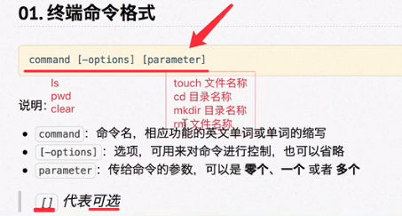

- [[linux]] `command [-options] [parameter]`
  * `command [-options] [parameter]` # 终端命令格式
  * ***注意事项***
  * `command` # 命令名
  * `[]` # 可选 (大白话: 可有可无)
  * `options` # 选项
  * `parameter` # 参数
  * ***参考资料***
  * 
  * [017 17-Linux命令-05-终端命令格式.mp4](https://www.aliyundrive.com/s/XmEsDZd9HoT/folder/61b86a0b8f36617c43f64d24a0384f163f0c5d08)
- [[linux]] `ip address | grep inet`
  * `ip address | grep inet` # 查看网卡 ip 地址
  * ***注意事项***
  * `ip address` # 网卡配置信息
  * `|` # pipe (管道) (一个命令的输出，作为另一个命令的输入。大白话：将左边命令显示出来的结果，用右边命令来显示)
  * `grep` # 文本搜索 (相当于网页浏览器的 `ctrl + f`)
  * `inet` # grep 搜索的文本
  * ***参考资料***
  * 
  * 
  * [045 45-Linux命令-04-ifconfig查询网卡信息.mp4](https://www.aliyundrive.com/s/XmEsDZd9HoT/folder/61b86a0b8f36617c43f64d24a0384f163f0c5d08)
-