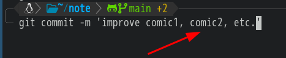
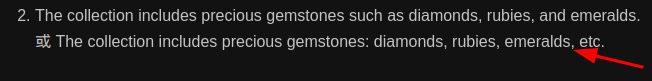

- 英语 `, etc.` (等等) 使用
  * `comic1, comic2, etc.` # 漫画1, 漫画2, 等等。
  * ***注意事项***
  * `comic1, comic2` # 两个同类事物 (你可以自定义两个及以上)
  * `, etc.` # 等等，`tec` 前要有 `, ` (逗号空格), 其后要有 `.` (英文句点)
  * ***参考资料***
  * 
  * 
  * [学术英语：关于such as, for example, etc., and so on, i.e., 和e.g.的使用](https://blog.csdn.net/Anne033/article/details/121046075)
-
