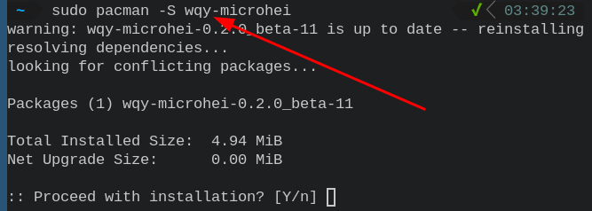
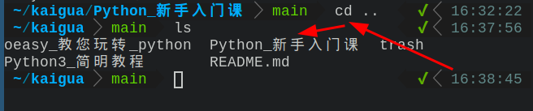
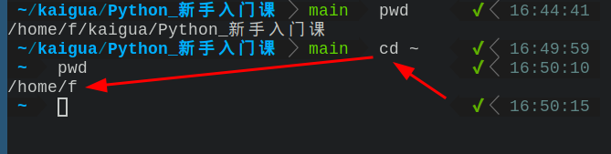
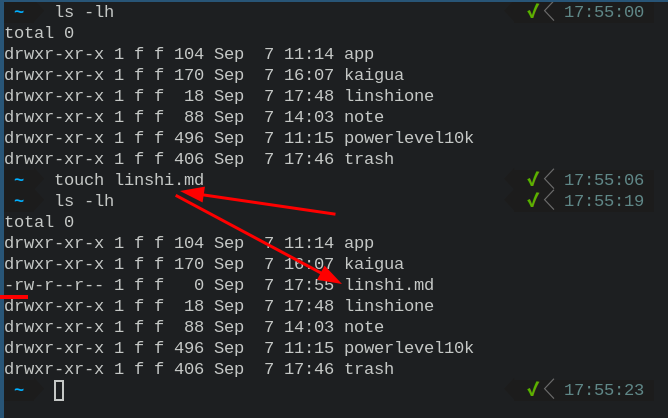
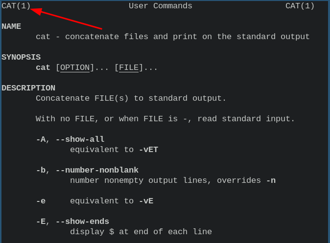
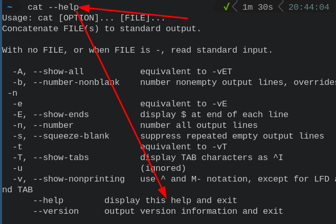

- #### Display user name
    - `whoami`
- ***Notes***
    - Other methods
        - `echo $USER`
        - `echo $LOGNAME`
        - `id --user --name`
        - `who`
        - `logname`
    - Because to share reuse scripts with everyone.Because to share reuse scripts with everyone.
- ***References***
    - `man id`
    - ChatGPT
- ---
- [[linux]] `chown -R owner:group file`
  * `chown` # change owner (改变拥有者)
  * `-R` # R:recursive (递归的) (应用场景：连同目录及其下的所有文件及目录)
  * `owner` # 用户名 (可使用 `whoami` 在终端中查看)
  * `group` # 组 (一般情况下，与 owner (用户名)一致)
  * `file` # 文件 (linux 一切皆文件 (包括目录，可配合上面的 `-R` 一起使用))
  * ***参考资料***
  * `man chown` # manual (手册) (在终端中查看)
  * [如何更改 linux 文件的拥有者和用户组 (chown 和 chgrp)](https://blog.csdn.net/hudashi/article/details/7797393)
  * 
- wallpaper (2022-09-07)
  * 
  * 
- my chinese font (2022-09-07)
  * `wqy-microhei` # 安装中文字体 `wqy-microhei` (有效解决中文乱码问题)
  * ***参考资料***
  * 
- >实践是检验真理的唯一标准 #quote
  
  * 实践就像是编程里的 coding (写代码)
  * 
- Python 新手入门课，二刷中……
- Linux 目录操作
  * `ls` # `list` (列出) (列出当前目录下的文件及目录)
  * 
  * `cd` # `change directory` (切换目录) (切换到其他目录下)
  * 
      * ***快捷操作***
          * `cd ..` # `..` (上一级) (切换到上一级目录)
          * 
          * `cd -` # `-` (上一次) (切换到上一次所在目录) (效果：在最近的两次目录中无限循环)
          * 
          * `cd ~` # `~` (/home/your_owner_name) (切换到 /home 目录下的当前用户名的目录下)
          * 
          * `cd /` # `/` (根目录) (切换到根目录下)
          * 
      * ***绝对路径***
          * `pwd` # `print working directory` (打印工作中的路径)
          * 
          * `cd /home/f/kaigua/Python_新手入门课` # 切换到该目录下 (无论你在哪个目录) (记补全或降低输入错误可以使用 Tab 键补全)
          * 
      * ***新建目录***
          * `mkdir linshi` # `make directory` (制作目录) (制作一个名叫 linshi 的目录)
          * 
          * `mkdir -p linshi/linshione` # `parents` (父母) (制作有父母关系的目录) (即使不存在)
          * 
- Linux_文件操作
  * `touch linshi.md` # `touch` (触碰) (触碰 linshi.md) (生成 linshi.md 文件)
  * 
  * `cp linshi.md linshione/linshitwo` # `copy` (复制) (复制 linshi.md 文件到 linshione/linshitwo 目录下)
  * 
  * `cp -r linshi linshione/linshitwo` # `recursive` (递归的) (递归地复制 linshi 目录到 linshione/linshitwo 目录下)
  * 
  * `rm linshi.md` # `remove` (消除) (消除 linshi.md 文件)
  * 
  * `rm -r linshione` # `recursive` (递归的) (递归地消除 linshione 目录及其下所有文件、目录)
  * 
  * `mv linshi.md linshi` # `move` (移动) (移动 linshi.md 文件到 linshi 目录下)
  * 
  * `mv linshi linshione` # `rename` (改名) (改名 linshi 目录为 linshione 目录)
  * 
      * ***查看文件内容***
          * `cat linshi.md` # `concatenate` (连接) (连接 linshi.md 文件并打印到标准输出上)
          * 
          * `cat -n linshi.md` # `number` (编号) (给连接 linshi.md 文件所有输出行编号并打印到标准输出上)
          * 
      * ***编辑文件***
          * 
      * ***帮助命令***
      * `man cat` # `manual pages` (手册页) (查看 cat 命令的手册页)
      * 
      * `cat --help` # `help` (帮助) (显示 cat 命令的帮助)
      * 
      * 
-
