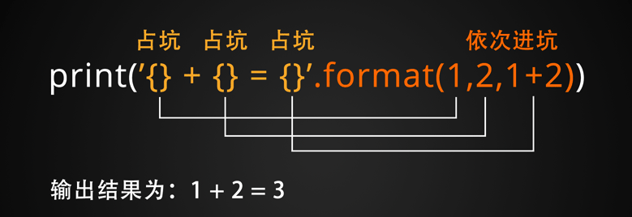
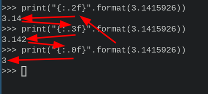
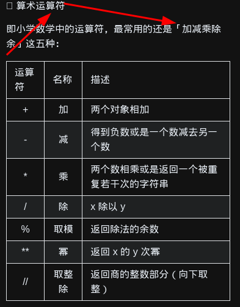
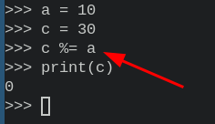
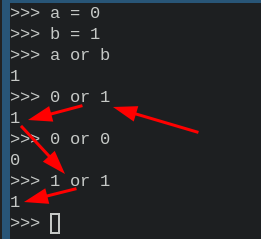
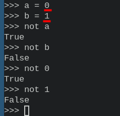

- [[python]] 认识 Python
  * ***进入 Python 开发环境***
      * `python3` # 调用 interpreter (口译员；解释器) 
      *  
      * `>>> ` # `primary prompt` (主要的提示符)，处于 interactive mode (交互模式)
      * `... ` # `secondary prompt` (辅助的提示符)，因为需要 continuation lines (续行)
      * 
      * `Control-D` `quit()` `exit()` # `exit the interpreter` (退出解释器)
      * 
  * ***第一行代码***
      * `print("Hello World!")` # `print()` (打印函数) `Hello World` (字符串) (用引号括起来) (无论是一对单引号、还是一对双引号，灵活使用)
      * 
  * ***数据类型***
      * `int` # `integer` (整数)
      * `float` # 浮点数 (小数) `3.14 = 0.314 * 10` (小数点可以改变位置，故称浮点数)
      * `Ture` `False` # `bool type` (布尔类型)
      * 
      * `None` # `NoneType` (无类型)
  * ***变量*** 
      * `name = "yaoniplan"`
      * `=` # `equal sign` (等号) `assign a value to variable` (分配一个值给变量)
      * `name` # `variable` (多变的，变量)
      * `"yaoniplan"` # `value` (值)
      * 
  * ***Input() 函数***
      * `ID = input("请输入你的ID：")` # `input()` (输入函数)
      * 
  * ***字符串***
      * `print('"isn\'t it," they said.')`
      * `'...'` `"..."` # `Strings` (字符串) (用引号括起来的就是字符串)
      * `backslashes` (反斜杠) # `escape quotes` ((逃脱，转义)引号)
      * 
      * ***索引***
          * `strings = "yaoniplan"`
          * `strings[0]` # 第一个字符的索引为 0
          * `strings[-1]` # 最后一个 (倒数第一个) 字符的索引为 -1
          * 
      * ***format()***
          * `format()` # 专门用来格式化字符串的函数
          * ***插入数据***
              * `print("你叫{}，今年{}岁了".format(name, age))`
              *  
              * `"{} {}".format(a, b)` # 等价于 `"{0} {1}".format(a, b)`
              * 
          * ***数字格式化***
              * `print("{:.2f}".format(3.1415926))` # 保留两位小数
              * 
  * ***注释***
      * `# ` # `# ` (井号) 后面的内容 (包括代码) 会被忽略 (适用于单行注释；暂时不需要执行的代码)
      * 
  * ***运算符***
      * ***算术运算符*** # 常用的有 `+ - * / %` (加减乘除余)
          * `a + b` # `+` (加) (a 加上 b)
          * `a - b` # `-` (减) (a 减去 b)
          * `a * c` # `*` (乘) (a 乘以 c)
          * `a / c` # `/` (除) (a 除以 c)
          * `b % a` # `%` (余) (b 除以 a 的余)
          * `a ** b` # `**` (幂) (a 的 b 次幂)
          * `c // b` # `//` (整) (c 除以 b 的整)
          * 
          *  
      * ***比较运算符*** # 常用于 判断和循环 中
          * `a == b` # `==` (等于) (a 等于 b)
          * `a != b` # `!=` (不等于) (a 不等于 b)
          * `a > c` # `>` (大于) (a 大于 c)
          * `a < c` # `<` (小于) (a 小于 c)
          * `b >= c` # `>=` (大于等于) (b 大于等于 c)
          * `b <= c` # `<=` (小于等于) (b 小于等于 c)
          * 
          *  
      * ***赋值运算符*** # 主要是为了简写
          * `c = a + b` # `=` (赋值符，等号) (分配一个值给变量) (分配 `a + b` 的值给 `c` 这个变量)
          * `c += a` # `+=` (加法赋值符) (等价于 `c = c + a`)
          *  
          * `c -= a` # `-=` (减法赋值符) (等价于 `c = c - a`)
          *  
          * `c *= a` # `*=` (乘法赋值符) (等价于 `c = c * a`)
          *  
          * `c /= a` # `/=` (除法赋值符) (等价于 `c = c / a `)
          * 
          * `c %= a` # `%=` (余赋值符) (等价于 `c = c % a`)
          *  
          * `c **= a` # `**=` (幂赋值符) (等价于 `c = c ** a`)
          *  
          * `c //= a` # `//=` (整赋值符) (等价于 `c = c // a`)
          * 
      * ***逻辑运算符*** 
          * `0` `1` # `0` 代表 False; `1` 代表 True (在逻辑运算中)
          *  
          * `a and b` # `and` (与) (a 与 b 都为 Ture，则返回 True，否则返回 False)
          * 
          * `a or b` # `or` (或) (a 或 b 为 Ture，则返回 Ture)
          * 
          * `not a` # `not` (非) (a 为 True，则返回 False；否则返回 True)
          * 
- [[linux]] mv directory1 directory2 (solve: Direcroty not empty)
  * `cp -r directory1 directory2` # 递归地复制目录1到目录2
  * `rm -r directory1` # 递归地消除1目录
  * ***注意事项***
  * 产生问题的原因是目录2已经有目录1的同名目录，而 `mv` 命令不能够灵活的变通一下，所以采用 `cp` 和 `rm` 命令来实现功能
  * ***参考资料***
  * [mv: Directory not empty](https://askubuntu.com/questions/269775/mv-directory-not-empty)
  * 
-
