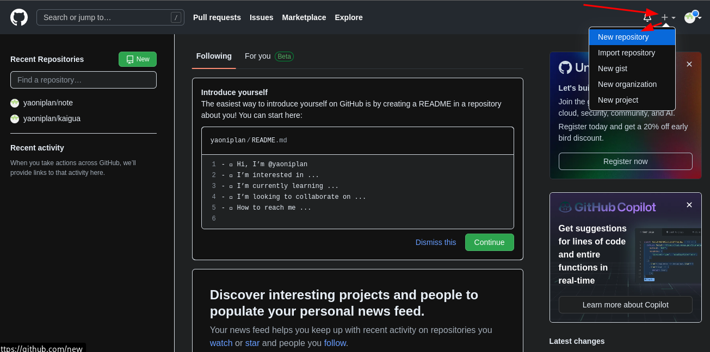
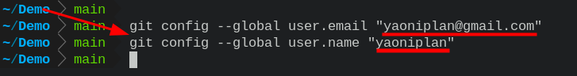
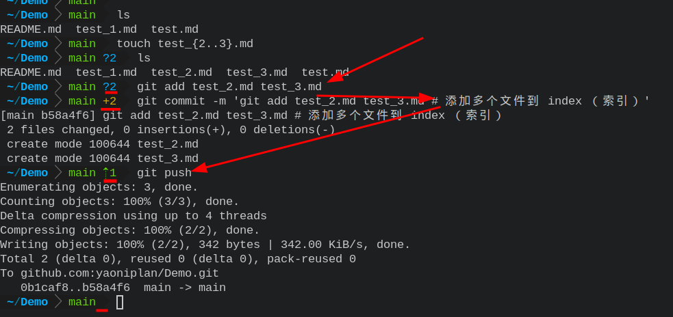

- * ***Git 和 GitHub***
  * `Git` # 版本 (更方便地管理版本)
  * 
  *  
  * `GitHub` # 代码 (更方便地管理代码)
  * 
  * 
  * ***Git 的安装***
      * `git` # 查看常用命令(顺便检测是否安装) (在终端输入)
      * 
      * 
  * ***在 GitHub 上创建仓库***
  * ***注册 GitHub 账号***
      * `github.com` # 输入 GitHub 官方网址 (在搜索引擎中)
      * `Sign up` # `Sign up` (注册)
      * 使用邮箱注册，验证通过即可 (在填写完相关信息之后)
  * ***新建代码仓库***
      * 
      * 
  * ***添加 SSH 关联授权***
      * `ssh-keygen` # 生成公钥私钥 (在终端输入，并按几次回车)
      * 
      * `cat ~/.ssh/id_rsa.pub` # 连接公钥文件并打印输出 (选中后，`ctrl + shift + c` (复制))
      * 在 GitHub 上添加公钥 (Title (标题) (你可自定义), Key (钥匙) (粘贴刚才复制的公钥))
      * 
      * 
      * 
      *  
      * `git clone git@github.com:yaoniplan/Demo.git` # 将远程仓库克隆到本地
      *  
      * `ls -al` # 以列表的形式列出所有文件 (在切换到 Demo 目录后) (出现 .git 目录即表示处于 Git 版本管理下)
      *  
      * `git config --global user.email "yaoniplan@gmail.com"` # commit 时的 Author 信息 (`yaoniplan@gmail.com` (请填写你注册 GitHub 时的邮箱))
      * `git config --global user.email "yaoniplan"` # commit 时的 Author 信息 (`yaoniplan` (请填写你注册 GitHub 时的账户名))
      *  
      *  
  * ***提交代码***
      * `git add .` # `add` (添加) `.`(当前目录) (你可以单独添加某个文件或多个文件) 文件到 index (索引) 
      * `git commit -m 'test'` # `commit` (record changes to the repository) 记录变化到仓库 `-m` (message) 信息 `test` (对变化的描述，你可以自定义)
      * `git push` # `push` (推送) 到远程仓库
      * 
      * 
      * 
-
