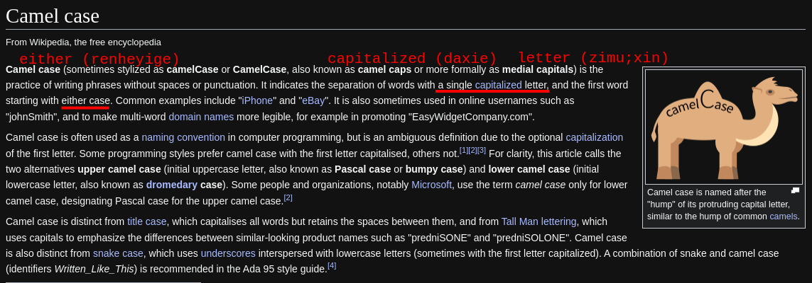

- #### python name good habits
    - `in English` # You can fluently read english tutorial after a while.
    - `camelCase` # lower camel case
    - `CamelCase` # upper camel case
- ***Notes***
    - `Server-Side Query` # serverSideQuery
        - Begin with a lowercase letter
        - Use only letters and numbers; avoid special characters
        - For each subsequent words, start with an uppercase letter
        - Eliminate all spaces between words
        - Merge all words into a single continuous string
- ***References***
    - 
    - 
- ---
- [[python]]check class
  * `type()` # This is a function that check class.
  * ***References***
  * 
-
