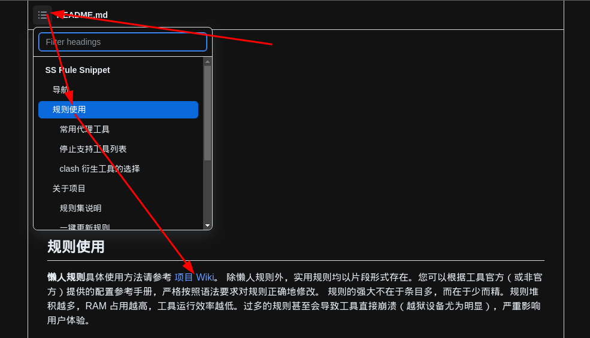
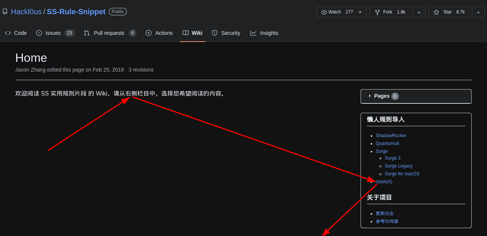

- #### Select server automatically in Clash
    - `vim ~/.config/clash/config.yaml`
      ```yaml
      - name: "auto"
        type: url-test
        proxies:
          - ss1
        url: 'http://www.gstatic.com/generate_204'
        interval: 300
      ```
- ***Notes***
    - `ss1` # Replace it with other proxy
    - 
    - 
    - 
    - 
- ***References***
    - https://github.com/Hackl0us/SS-Rule-Snippet
    - https://cdn.jsdelivr.net/gh/Hackl0us/SS-Rule-Snippet@master/LAZY_RULES/clash.yaml
