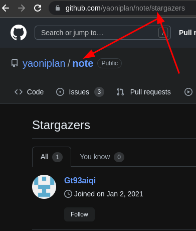

- [[github]]star view
  * `https://github.com/yaoniplan/note/stargazers` # add `/stargazers` to the end of the URL of a repository
  * ***References***
  *  
  * 
  * https://docs.github.com/en/get-started/exploring-projects-on-github/saving-repositories-with-stars#viewing-who-has-starred-a-repository
- [[symbol]]number sign `#`
  * ***References***
  * 
  * [Number sign - Wikipedia](https://en.wikipedia.org/wiki/Number_sign)
-
