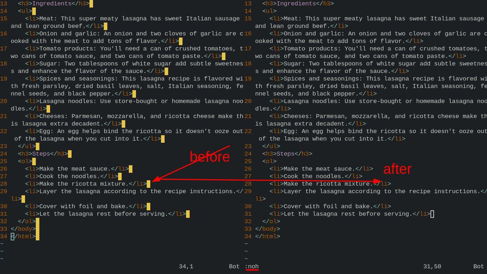

- [[GitHub]]repository created time (date)
	- `https://api.github.com/repos/yaoniplan/note`
- ***Notes***
	- `api.` # Add it before the "github.com/"
	- `repos/` # Add it after the "github.com/"
	- `note` # Remove the slash (*/*) after the repository name (*note*)
- ***References***
	- 
	- 
	- 
	- https://www.ilovefreesoftware.com/16/programming/check-creation-date-github-repository.html
- ---
- [[abbreviation]]"Graphics interchange format" (`GIF`)
- ***References***
	- 
	- [GIF - Wikipedia](https://en.wikipedia.org/wiki/GIF)
- ---
- [[Vim]]highlight disable temporarily
	- `:noh`
- ***References***
	- 
	- 
	- [Clear Search Highlight in Vim — tech.serhatteker.com](https://tech.serhatteker.com/post/2020-03/clear-search-highlight-in-vim/)
- ---
- #### Add string to the end of specified lines in Vim
    - `:'<,'>s/$/<\/li>/`
- ***Notes***
    - `:'<,'>`
        - `V` # Select lines in visual line mode
        - `:` # See the format
    - `s` # Substitute
    - `$` # The end of line
    - `<\/li>` # Replace it with your desired string
        - `backslash` # Escape character
- ***References***
    - 
    - 
    - https://stackoverflow.com/questions/253380/how-to-insert-text-at-beginning-of-a-multi-line-selection-in-vi-vim
- ---
