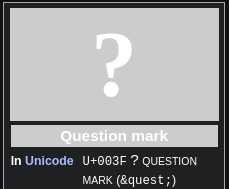

- ---
- # Add a [[abbreviation]]
  Yet Another Multicolumn Layout (`YAML`)
- ***References***
	- 
	- [YAML (framework) - Wikipedia](https://en.wikipedia.org/wiki/YAML_(framework))
- ---
- # Add a [[punctuation]]
  Question mark (`?`)
- ***References***
	- 
	- [Question mark - Wikipedia](https://en.wikipedia.org/wiki/Question_mark)
- ---
- #### The punctuation of "backtick" is <code>"`"</code>.
    - Another name
        - "grave"
- ***References***
    - 
    - https://en.wikipedia.org/wiki/Backtick
