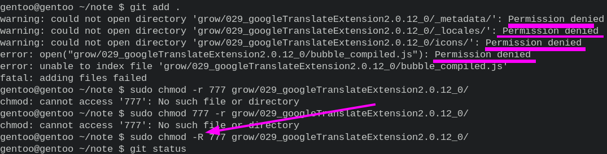
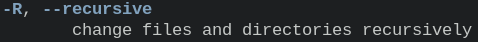
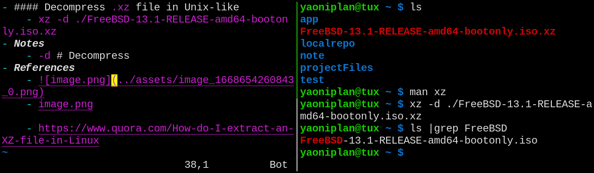

- #### Use "chmod"
	- `sudo chmod -R 777 ~/note/grow/029_googleTranslateExtension2.0.12_0/`
- ***Notes***
	- `-R` # recursive
	- `777` # the first "7" are permissions of **user**; the second "7" are permissions of **user's group**; the third "7" are permissions of **others**
		- `permissions` # read, write and execute
		- `7` # $2^2 + 2^1 + 2^0$
- ***References***
	- 
	- 
	- `man chmod`
- ---
- #### Use "qemu"
    - Create a disk image
        - `qemu-img create -f qcow2 ~/testQemu.cow 100G`
    - Install the OS
      ```
      qemu-system-x86_64 -m 8G -enable-kvm \
        -bios /usr/share/ovmf/x64/OVMF.fd \
        -nic user,hostfwd=tcp::60022-:22 \
        -cdrom /mnt/grow/230504archlinux-2023.05.03-x86_64.iso \
        -drive file=~/testQemu.cow,format=qcow2 \
        -boot order=d
      ```
    - Run the machine
      ```
      qemu-system-x86_64 -m 8G -smp 4 -enable-kvm \
        -bios /usr/share/ovmf/x64/OVMF.fd \
        -nic user,hostfwd=tcp::60022-:22 \
        ~/testQemu.cow -audiodev pa,id=sound0 \
        -device ich9-intel-hda \
        -device hda-output,audiodev=sound0
      ```
- ***Notes***
    - `-display sdl,gl=on -vga virtio` # Enable 3D acceleration if you cannot enter the desktop after entering the password in the window manager
    - `-bios /usr/share/ovmf/x64/OVMF.fd` # 64bit UEFI
    - `ssh yaoniplan@192.168.10.105 -p 60022` # Connect it
    - `doas pacman -S qemu-full` # Install dependencies
    - `doas pacman -S remmina` # Install the VNC client (Another way)
      ```
      # Click the "New connection profile" icon
      Remmina VNC plugin for GNOME and KVM # Protocol
      localhost:5900 # Server
      # Click the "Save" button
      # Double-click to connect the VNC server
      ```
- ***References***
    - https://pkgbuild.com/~tpowa/archboot/web/archboot.html
    - https://leedev.org/2015/12/13/arch-linux-qemu.html
    - https://ict4g.net/adolfo/notes/admin/qemu-virtual-machines.html
    - ChatGPT
- ---
- #### Understand "Wayland"
    - A display server protocol
    - Replace X11
- ***References***
    - 
    - https://www.cbtnuggets.com/blog/technology/networking/why-use-wayland-versus-x11
- ---
- #### Decompress a ".xz" file in Unix-like
    - `xz -d ./FreeBSD-13.1-RELEASE-amd64-bootonly.iso.xz`
- ***Notes***
    - `-d` # Decompress
- ***References***
    - `man xz`
    - 
    - https://www.quora.com/How-do-I-extract-an-XZ-file-in-Linux
- ---
