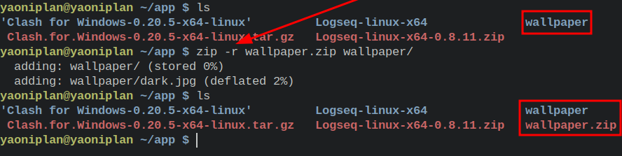
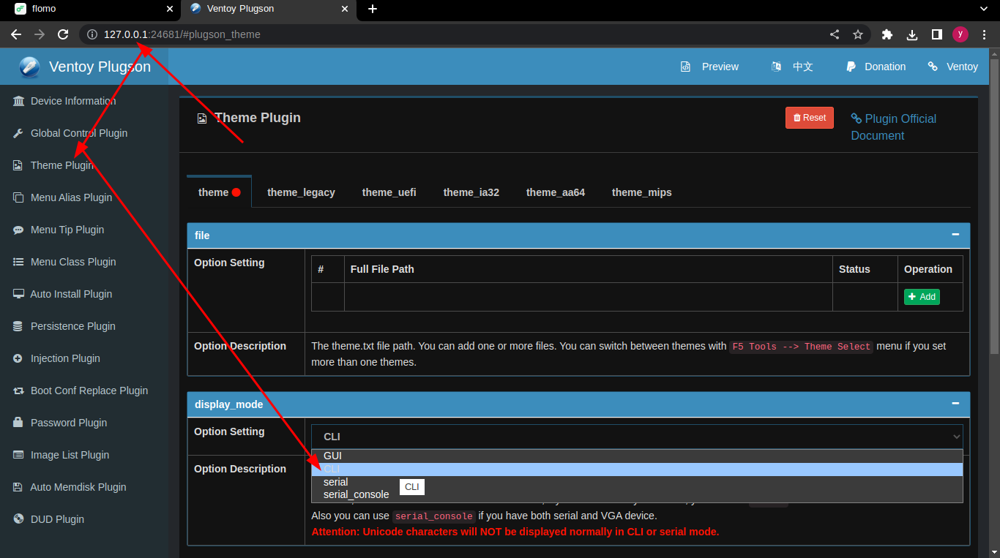
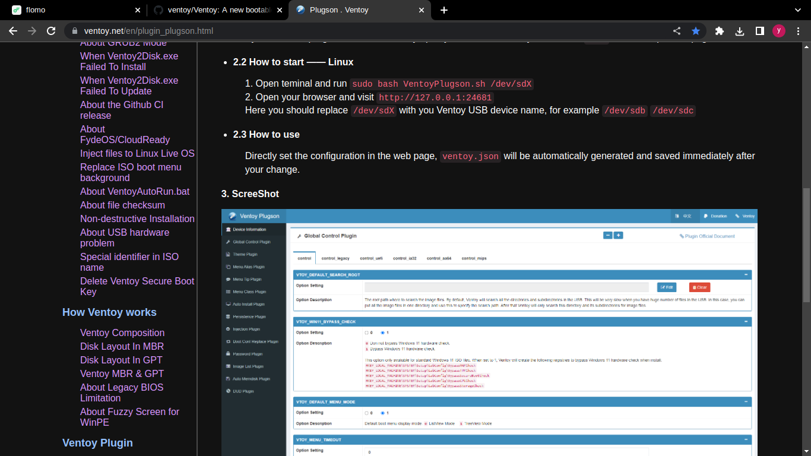

- ---
- #### Compress folder as a ".zip" file
    - `zip -r wallpaper.zip wallpaper/`
- ***Notes***
    - `zip`
        - `doas emerge -aq zip` # Install it if you do not have it
    - `-r` # Recursive
    - `wallpaper/` # A folder you want to compress
- ***References***
    - `man zip`
    - 
- ---
- Do not use "sudo rm -rf test/" unless you used "sudo cp -r test/ /tmp/" before. #Idea #Linux
- ---
- #### Set dark mode in Ventoy
    - `doas ./VentoyPlugson.sh /dev/sdc`
    - `http://127.0.0.1:24681`
    - Change the "display_mode" in "Theme Plugin" from "GUI" to "CLI"
- ***Notes***
    - `doas mount /dev/sdc1 /mnt/SanDisk` # Mount it before using the command
    - `/dev/sdc` # Replace it with your block device
        - `lsblk` # Get it (e.g. /dev/sda, /dev/sdb, etc.)
    - Warning: It has some bugs about displaying.
- ***References***
    - 
    - 
    - 
    - https://www.ventoy.net/en/plugin_plugson.html
    - https://github.com/ventoy/Ventoy/releases
- ---
