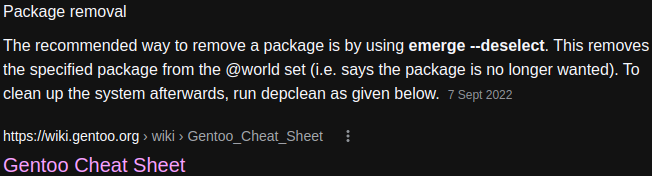

- #### Use "sddm" theme in Gentoo Linux
    - `git clone https://github.com/MarianArlt/sddm-chili`
    - `doas mv ~/sddm-chili /usr/share/sddm/themes/`
    - `doas vim /usr/share/sddm/sddm.conf.d/00default.conf`
      ```
      [Theme]
      # Current theme name
      Current=sddm-chili
      ```
- ***Notes***
    - `/usr/share/sddm/sddm.conf.d/00default.conf` # SDDM's config file
        - `doas updatedb` # Update a database for mlocate
        - `locate sddm.conf` # Locate file including "sddm.conf" text
    - `doas emerge --ask dev-qt/qtquickcontrols` # Solve an error
      ```
      file:///usr/share/sddm/themes/sddm-chili//Main.qml:22:1: module "QtQuick.Controls" is not installed
      ```
    - `doas emerge --ask dev-qt/qtgraphicaleffects` # Solve an error
      ```
      file:///usr/share/sddm/themes/sddm-chili//components/Wallpaper.qml:21:1: module "QtGraphicalEffects" is not installed
      ```
    - `doas vim /usr/share/sddm/themes/sddm-chili/theme.conf` # Customize the theme
      ```
      # Screen resolution (Use command: screenfetch or neofetch)
      ScreenWidth=1366
      ScreenHeight=768
      
      # Size (between 10 and 16) of font
      FontPointSize=15
      # Pixel size of avatar
      AvatarPixelSize=150
      ```
    - `/usr/share/sddm/faces/yaoniplan.face.icon` # Avatar file
        - `/usr/share/sddm/faces/` # Add your coustomized picture to the avatar folder
        - `yaoniplan` # Change it to your user name
        - `.face.icon` # Keep it default
          ```
          # /usr/share/sddm/themes/sddm-chili/Main.qml
          text = new Date().toLocaleString(Qt.locale("en_US"), "ddd dd MMMM yyyy, hh:mm")
          ```
    - Optional: Take a screenshot of the login screen
        - `sddm-greeter --test-mode --theme /usr/share/sddm/themes/sddm-chili/`
        - Press the **print screen** key to take a screenshot
    - Solve the problem about white background
      
        - Convert *background.jpg* file to *background.png* file (Make sure the image file extension is *png*)
        - Make sure there is a *background.png* file in the `/usr/share/sddm/themes/sddm-chili/assets/` directory
        - `doas vim /usr/share/sddm/themes/sddm-chili/theme.conf`
          ```
          [General]
          background=assets/background.png
          ```
- ***References***
    - 
    - 
    - https://github.com/MarianArlt/sddm-chili/issues/15#issuecomment-1764010005
    - https://askubuntu.com/questions/43458/how-can-i-take-a-screenshot-of-the-login-screen
    - https://github.com/MarianArlt/sddm-chili
- ---
- SDDM Usage Gentoo Linux DM
	- `sudo emerge --ask x11-misc/sddm` # Install **x11-misc/sddm**
	- `sudo usermod -a -G video sddm` # Add the **sddm** to the **video** group
- ***Notes***
	- **OpenRC**
		- `doas emerge --ask gui-libs/display-manager-init`
		- `doas vim /etc/conf.d/display-manager`
		  ```
		  CHECKVT=7
		  DISPLAYMANAGER="sddm"
		  ```
		- `rc-update add display-manager default` # Add the **display-manager** to the system's **default** runlevel
		- `rc-service display-manager start` # Start the **display-manager**
	- Another way
		- `echo "exec dwm" >> ~/.xinitrc` # Repalce `dwm` with your WM
        - `echo "startx" >> ~/.bash_profile`
- ***References***
	- https://wiki.gentoo.org/wiki/SDDM
- ---
- The abbreviation of the "Miscellaneous" is "misc".
- ***References***
	- 
- ---
- Remove package from @world set #Gentoo #Linux
	- `sudo emerge --deselect sys-kernel/gentoo-kernel-bin`
	- ***Notes***
		- `cat /var/lib/portage/world | less` # View packages in the @world set
	- ***References***
		- 
		- 
		- [Gentoo Cheat Sheet - Gentoo Wiki](https://wiki.gentoo.org/wiki/Gentoo_Cheat_Sheet#:~:text=Package%20removal,-Recommended%20method&text=The%20recommended%20way%20to%20remove,run%20depclean%20as%20given%20below.)
