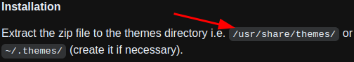
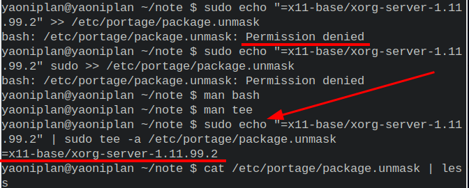
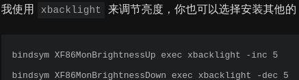

- ---
- Nordic-darker theme installation
	- `sudo cp -r Nordic-darker/ /usr/share/themes/`
	- ***Notes***
		- `Nordic-darker/` # The theme folder
			- `tar -xf Nordic-darker.tar.xz` # Extract the file if you download it
		- `/usr/share/themes/` # Add your theme folder to this derectory
	- ***References***
		- 
		- 
		- https://github.com/EliverLara/Nordic#installation
- ---
- Extract (decompress) `.tar.xz` file #Linux #Command
	- `tar -xf Nordic-darker-v40.tar.xz`
	- ***Notes***
		- `-x` # Extract
		- `-f` # File
	- ***References***
		- 
		- 
		- `man tar` # Search (by pressing "**/**") "**-x**" or "**-f**" in manual page about tar
		- [How to Uncompress Tar.xz Files?](https://linuxhint.com/uncompress-tar-xz-files/)
- ---
- Solve problem about "echo", ">>" and permission #Linux #Command
	- `echo "=x11-base/xorg-server-1.11.99.2" | sudo tee -a /etc/portage/package.unmask`
	- ***Notes***
		- `tee` # Replace **output redirection** (e.g. **>** and **>>**)
		- `-a` # Append
	- ***References***
		- 
		- ```
		  yaoniplan@yaoniplan ~/note $ sudo echo "=x11-base/xorg-server-1.11.99.2" sudo >> /etc/portage/package.unmask
		  bash: /etc/portage/package.unmask: Permission denied
		  ```
		- `man tee`
		- https://askubuntu.com/questions/103643/cannot-echo-hello-x-txt-even-with-sudo
- ---
- #### Kvantum installation #Qt #Theme #application
	- `sudo emerge -aq --autounmask=y --autounmask-write x11-themes/kvantum`
	- `sudo etc-update`
		- `-3` # Type it, then press "enter" key
		- `Y` # Type it, the press "enter" key
	- `sudo emerge -aq x11-themes/kvantum` # Install it now
- ***Notes***
	- `--autounmask=y` `--autounmask-write` # Solve the following error
	  ```
	  !!! All ebuilds that could satisfy "x11-themes/kvantum" have been masked.
	  !!! One of the following masked packages is required to complete your request:
	  - x11-themes/kvantum-1.0.1::gentoo (masked by: ~amd64 keyword)
	  ```
- ***References***
	- 
	- [Knowledge Base:Accepting a keyword for a single package - Gentoo Wiki](https://wiki.gentoo.org/wiki/Knowledge_Base:Accepting_a_keyword_for_a_single_package)
- ---
- Lxappearance installation #GTK #Theme #application
	- `sudo emerge -aq lxde-base/lxappearance`
- ---
- Rofi installation #i3 #Gentoo #Linuxn
	- `sudo emerge -aq x11-misc/rofi`
	- `sudo vim ~/.config/i3/config`
		- ```
		  # start dmenu (a program launcher)
		  #bindsym $mod+d exec --no-startup-id dmenu_run
		  # A more modern dmenu replacement is rofi:
		  bindsym $mod+d exec "rofi -modi drun,run -show drun"
		  ```
	- ***Notes***
		- `-a` # Ask
		- `-q` # Quiet
	- ***References***
		- 
		- `man emerge` # Type (by pressing "**/**") "**--ask**" or "**--quiet**" in manual page about emerge
- ---
- #### Set brightness on i3 and Gentoo Linux
    - `sudo emerge --ask x11-apps/xbacklight`
    - `sudo vim ~/.config/i3/config`
      ```
      bindsym XF86MonBrightnessUp exec xbacklight -inc 10
      bindsym XF86MonBrightnessDown exec xbacklight -dec 10
      ```
- ***Notes***
    - `sudo reboot` # Reboot the operating system finally
- ***References***
    - 
    - https://zjuyk.gitlab.io/posts/i3wm-config/
- ---
- #### Enable audio or sound in Gentoo Linux
	- `cd /usr/src/linux`
	- `doas make menuconfig`
	- `doas make -j6`
	- `doas make modules_install`
	- `doas make install`
	- `doas euse -E alsa`
	- `doas emerge -avuDN @world`
	- `doas emerge -aq media-sound/alsa-utils`
	- `doas gpasswd -a yaoniplan audio`
	- `doas rc-update add alsasound boot`
	- `alsamixer`
- ***Notes***
	- `doas make menuconfig` # Refer this [link](https://wiki.gentoo.org/wiki/ALSA#Hardware_detection) to activate kernel options
		- `lspci | grep -i audio` # List all PCI devices and print lines containing *audio* ignoring case
			- `lspci` # List all PCI devices
			- `-i` # --ignore-case
	- `doas euse -E alsa` # Enable the USE flag (*alsa*) in */etc/portage/make.conf*
		- `-E` # --enable
		- `doas emerge -aq app-portage/gentoolkit` # Install it to use the *euse* command
	- `doas gpasswd -a yaoniplan audio` # Add the user to the group
		- `-a` # --add
		- `yaoniplan` # Replace it with a name of your user
		- `audio` # A group
		- `grep audio /etc/group` # Print lines containing *audio* in */etc/group* file
	- `doas rc-update add alsasound boot` # Add the service to the runlevel by using *OpenRC*
		- `alsasound` # A service
		- `boot` # A runlevel
	- `alsamixer`
		- Press the `M` key to unmute if display `MM`
		- Press the `Escape` key to exit the interface
	- **Try this first**: Install **media-sound/pulseaudio** if your keyboard doesn't control the sound # Refer this [link](https://wiki.gentoo.org/wiki/PulseAudio) to install it
		- Because it use **pactl** to adjust volume in #PulseAudio in [[Gentoo Linux]] by default
			- `pactl` # #PulseAudio control
- ***References***
	- `man rc-update`
	- `man gpasswd`
	- `man euse`
	- `man grep`
	- `man lspci`
	- [ALSA - Gentoo Wiki](https://wiki.gentoo.org/wiki/ALSA)
- ---
- #### Install google-chrome in Gentoo Linux
    - `sudo vim /etc/portage/package.license`
      ```
      www-client/google-chrome google-chrome
      ```
    - `sudo emerge --ask www-client/google-chrome`
- ***Notes***
    - `www-client/google-chrome google-chrome` # Accept license if you want to install and use this software
- ***References***
    - https://wiki.gentoo.org/wiki/Chrome
- ---
