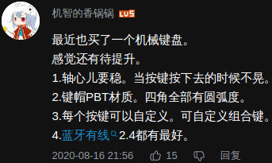
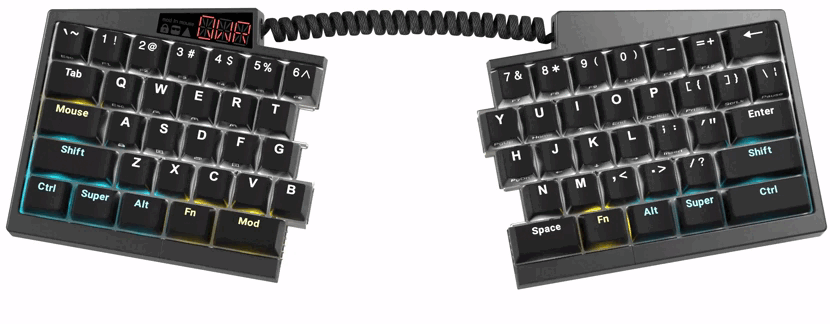

- ---
- #### Choose a keyboard for a computer
	- `Mechanical` `fast response` `PBT`
- ***Notes***
    - **Form factor**
        - 100% (full-size) # Large and inefficient
    - **Ergonomic**
        - Align the "H" key with the center of the body
        - Flat and follow the angle of the thighs
	- **Wired and wireless**
	- **Arrow and function key**
	- **Switches**
      | Name  | Type    | Force | Noise   |
      |-------|---------|-------|---------|
      | Brown | Tactile | 45 g  | Average |
      | Clear | Tactile | 65 g  | Average |
      | Red   | Linear  | 45 g  | Low     |
      | Black | Linear  | 60 g  | Low     |
      | Blue  | Clicky  | 50 g  | High    |
	- **Typing and programming**
		- Build quality
			- Plastic # Cheap, but will flex when you press too hard
			- Metal or higher-quality
		- Keycaps
			- ABS # Prone to wear and become smooth with heavy use
			- PBT # More durable
		- Programmability
			- Onboard # Customize certain keys
		- Removable cable
			- Removeable USB cable # Replace just the cable rather than the whole keyboard
- ***References***
	- 
	- 
	- 
	- 
	- 
	- 
	- 
	- 
	- 
	- 
	- https://www.nytimes.com/wirecutter/blog/how-to-shop-for-a-mechanical-keyboard/
	- https://ergo.human.cornell.edu/AHTutorials/ckd.htm
	- https://www.bilibili.com/video/BV1jm4y1R7kz/?spm_id_from=333.337.search-card.all.click
	- https://ultimatehackingkeyboard.com/
- ---
- #### CopyQ installation #application
	- `sudo emerge -aq --autounmask=y --autounmask-write x11-misc/copyq`
		- `sudo etc-update`
		- `-3` # Merge all files automatically
	- `sudo emerge -aq x11-misc/copyq`
- ---
- #### I am trying to replace "unorder list" syntax with "heading" syntax. #Idea
	- because it has a link to share anyone.
