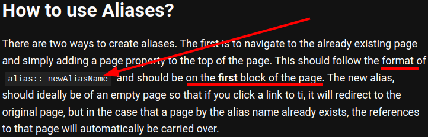

- Set some aliases for pages in #Logseq
	- Type this code (`alias:: extensions`) on the first block of the page and replace *extensions* with your alias
- ***Notes***
	- What is alias?
	- This means **merging pages** with **the same meaning**.
- ***References***
	- 
	- 
	- [The Ultimate Guide to Aliases in Logseq | Aryan Sawhney](https://aryansawhney.com/pages/the-ultimate-guide-to-aliases-in-logseq/)
- ---
- #### Use "global speed"
	- Disable all hotkeys except itself (Enable the hotkey only) for the Global Speed extension
        - Create a "state" in "Shortcut Editor" (In options.html)
        - Click on "NoKey" and press your desired shortcut key (e.g. `Alt-s`)
        - Remeber to avoid hotkeys conflicts with other extension (e.g. Vimium )
- ***Notes***
    - Enable web page full screen playback
        - Because sometimes don't want to fill the entire screen
        - Tab capture (In extension's options.html) - Create - Click the Assign icon to open `about://extensions/shortcuts` keyboard shortcuts
        - Click the Edit icon to set `command A` shorcut key you want (e.g. `Ctrl + Shift + F`)
    - Volumn control
        - Audio Effects selection - gain - 1.5
        - Adjust the video's volume slider to change the default volume
        - https://github.com/polywock/globalSpeed/issues/196#issuecomment-1109283484
        - https://github.com/polywock/globalSpeed/issues/292#issuecomment-1343084217
    - Because to set the default video speed for the browser.
- ***References***
    - https://github.com/polywock/globalSpeed/issues/390#issuecomment-1627868885
- ---
- #### Stop forgetting to breathe #Idea
	- Exhale on the effort
- ***References***
	- 
	- [Don't Forget to Breathe - YouTube](https://www.youtube.com/watch?v=LxD3e-K9vug)
