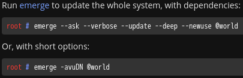
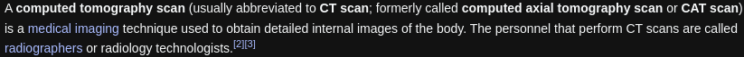

- ---
- #### Modify brightness in Gentoo Linux
	- `sudo emerge -aq sys-power/acpilight`
	- `sudo usermod -a -G video yaoniplan`
	- `sudo vim /etc/udev/rules.d/90-backlight.rules`
	  ```
	  # Allow video group to control backlight and leds
	  SUBSYSTEM=="backlight", ACTION=="add", \
	    RUN+="/bin/chgrp video /sys/class/backlight/%k/brightness", \
	    RUN+="/bin/chmod g+w /sys/class/backlight/%k/brightness"
	  SUBSYSTEM=="leds", ACTION=="add", KERNEL=="*::kbd_backlight", \
	    RUN+="/bin/chgrp video /sys/class/leds/%k/brightness", \
	    RUN+="/bin/chmod g+w /sys/class/leds/%k/brightness"
	  ```
- ***Notes***
	- `sudo usermod -a -G video yaoniplan`
		- `mod` # Modify
		- `-a` # --append
		- `-G` # --groups
		- `video` # a name of group
		- `yaoniplan` # Replace it with your name of user
- ***References***
	- 
	- 
	- `man usermod`
	- https://linuxize.com/post/how-to-add-user-to-group-in-linux/
	- https://gitlab.com/wavexx/acpilight
- ---
- #### Remove packages form the operating system in Gentoo Linux
	- `sudo emerge --depclean x11-apps/xbacklight`
- ***Notes***
	- `doas emerge -c app-admin/sudo`
		- `-c` # Replace *--depclean* with *-c*
	- 
	  
- ***References***
	- `man emerge`
	- 
	- https://unix.stackexchange.com/questions/42783/safely-uninstall-a-package-in-gentoo
- ---
- #### Update the whole system in Gentoo Linux
	- `sudo emerge -avuDN @world`
- ***Notes***
	- `-a` # --ask
	- `-v` # --verbose
	- `-u` # --update
	- `-D` # --deep
	- `-N` # --newuse
	- If you have the problem
	  ```
	  !!! existing preserved libs:
	  >>> package: x11-libs/libdrm-2.4.114
	   *  - /usr/lib64/libdrm_amdgpu.so.1
	   *  - /usr/lib64/libdrm_amdgpu.so.1.0.0
	   *      used by /usr/lib64/xorg/modules/drivers/amdgpu_drv.so (x11-drivers/xf86-video-amdgpu-22.0.0)
	  Use emerge @preserved-rebuild to rebuild packages using these libraries
	   * After world updates, it is important to remove obsolete packages with
	   * emerge --depclean. Refer to `man emerge` for more information.
	  ```
		- `sudo emerge --depclean` # Remove obsolete packages
		- `sudo emerge @preserved-rebuild` # Clean up the old library version
    - Solve the problem
      ```
       * IMPORTANT: 5 config files in '/etc' need updating.
       * See the CONFIGURATION FILES and CONFIGURATION FILES UPDATE TOOLS
       * sections of the emerge man page to learn how to update config files.
       * After world updates, it is important to remove obsolete packages with
       * emerge --depclean. Refer to `man emerge` for more information.
      ```
        - `doas etc-update` # Update all config files in '/ect'
        - `doas emerge --depclean` # Remove obsolete packages
        - `doas reboot`
- ***References***
	- 
	- `man emerge`
	- [Upgrading Gentoo - Gentoo Wiki](https://wiki.gentoo.org/wiki/Upgrading_Gentoo)
	- [@preserved-rebuild - Gentoo Wiki](https://wiki.gentoo.org/wiki/Preserved-rebuild)
- ---
- #### The abbreviation of the "Unicode Transformation Format - 8-bit" is the "UTF-8". #Idea
- ***Notes***
	- An encoding
- ***References***
	- 
	- https://en.wikipedia.org/wiki/UTF-8
- ---
- #### Understand the #LLVM. #Idea
- ***Notes***
	- A #compiler
	- It took about four hours to compile the *sys-devel/llvm* in [[Gentoo Linux]]. (e.g. 15:50-20:07)
- ***References***
	- 
	- 
	- [LLVM - Wikipedia](https://en.wikipedia.org/wiki/LLVM)
- ---
- #### The #abbreviation of the [[Good Game]] is #GG. #Idea
- ***Notes***
	- A #slang
	- Used at the **end** of a gaming match commonly
- ***References***
	- 
	- [GG - Wiktionary](https://en.wiktionary.org/wiki/GG#:~:text=(online%20gaming%2C%20slang)%20Good,be%20used%20genuinely%20or%20sarcastically.)
- ---
- #### The #abbreviation of the [[computed tomography scan]] is [[CT scan]] . #Idea
- ***References***
	- 
	- [CT scan - Wikipedia](https://en.wikipedia.org/wiki/CT_scan)
- ---
- #### The abbreviation of the "identity document" is "ID". #Idea
- ***References***
	- 
	- https://en.wikipedia.org/wiki/Identity_document
