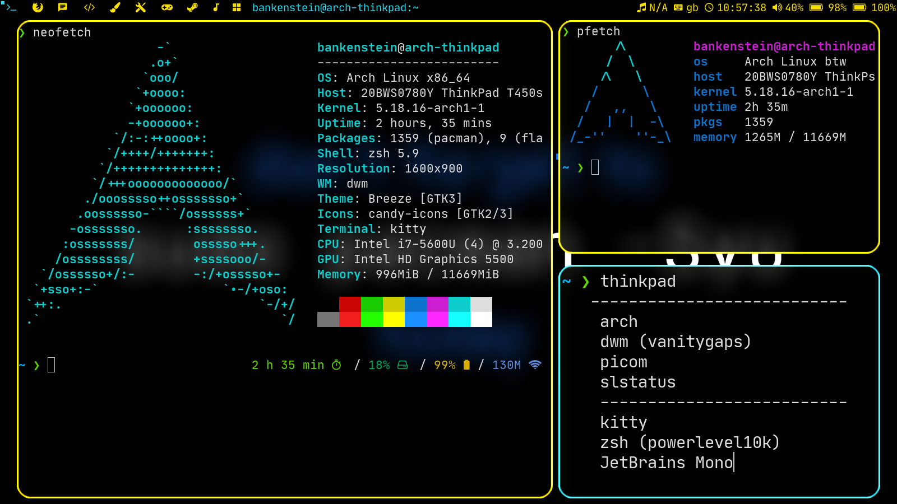

- [[outlook]] [[邮箱]] 每周只能添加两个别名
- #linux [Shell](https://blog.51cto.com/u_6364219/4920283)
  ```
  su 新用户名 #切换成新用户
  sudo pacman -S zsh #安装 zsh
  chsh -s /bin/zsh #修改默认的 Shell（chsh -l 可以查看已有 shell）
  git clone https://github.com/romkatv/powerlevel10k.git //下载 powerlevel10k
  sudo vim /home/用户名/.zshrc //编辑 .zshrc 并添加 source ~/powerlevel10k/powerlevel10k.zsh-theme
  ```
- #linux [dwm](https://codeberg.org/bankenstein/dwm)  
  1. sudo pacman -S libx11 //为了构建 dwm
  2. git clone https://codeberg.org/bankenstein/dwm.git
  3. cd dwm
  4. sudo make clean install
- #linux dwm  
  1. **WM**: [dwm](https://dwm.suckless.org/)(with [vanitygaps](https://dwm.suckless.org/patches/vanitygaps/) patch)
  2. **Compositor**: [picom](https://aur.archlinux.org/packages/picom-jonaburg-git)(*sudo pacman -S picom*)
  3. **Colours**: `#FAE100`, `#32DBF0`
  4. **dwm bar**: [slstatus](https://github.com/drkhsh/slstatus)(*git clone https://git.suckless.org/slstatus*)
  5. **Terminal**: [kitty](https://wiki.archlinux.org/title/Kitty)(*sudo pacman -S kitty*)
  6. **Shell theme**: a custom [powerlevel10k](https://github.com/romkatv/powerlevel10k) config
  7. **Font**: [JetBrains Mono](https://www.jetbrains.com/lp/mono/)(*sudo pacman -S ttf-jetbrains-mono*)
  8. **Wallpaper**: [some text on a black background](https://imgur.com/14AnL7O)(he made it himself)(the other font is [Eternal UI](https://www.cufonfonts.com/font/eternal-ui))
  9. **Dotfiles**: [him dwm build](https://codeberg.org/bankenstein/dwm)
  10. **Theme**: breeze(*sudo pacman -S breeze*)
  11. **Icons**: candy-icons(*git clone https://aur.archlinux.org/candy-icons-git.git*)
- 