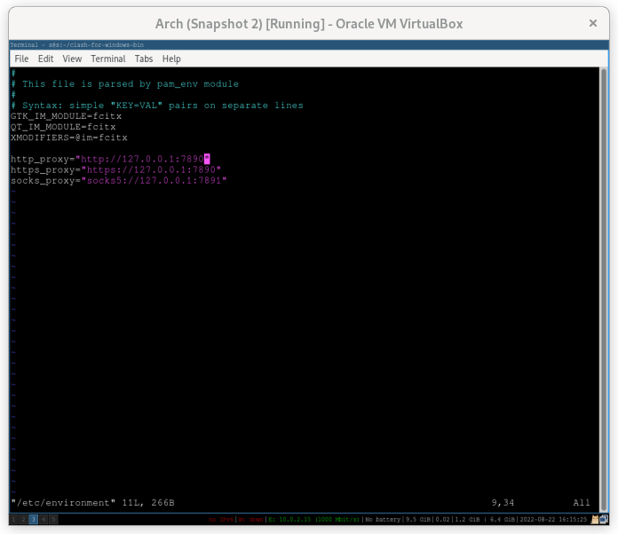

- 经测试，linux 可以使用输入法的终端 #idea 
  * xfce4-terminal
  * gnome-terminal
  * alacritty # 2022-09-05 还在使用
- 虚拟机 vmware-workstation 在 archlinux 中，与 qemu 一样折腾 #idea
- [[vim]] [[hotkey]]显示行号
  * `:set number` //显示行号
  * ***注意事项***
  * 退出 vim 后，再次打开 vim 则不显示，需再次输入 `:set number`
- [[linux]] [[解压]] [[.gz]] 命令
  * gzip -d filename.gz //解压 filename.gz 文件
- [[linux]] 设置系统 [[时间]]命令
  * date -s "2022-08-22 15:15:00" //同步时间 (`2022-08-22 15:15:00`：请填写所在时区对应的时间)
- [[linux]] [[i3]]网络代理([[proxy]])
  * sudo vim /etc/environment //添加以下三行：`export http_proxy="127.0.0.1:7890"` `export https_proxy="127.0.0.1:7890"` `export no_proxy="localhost,127.0.0.1"`
  * 下载 clash-for-windows //2022-08-22 在用 aur 中的 clash-for-windows-bin
  * source /etc/environment //重载 `/etc/environment` 配置
  * ***注意事项***
  * i3 搜索 `cfw` 才能在 dmenu 中找到并打开软件
  * ***参考资料***
  * [使用 Clash 为 Linux 提供网络代理服务](https://www.ahdark.com/som/1643.shtml "使用 Clash 为 Linux 提供网络代理服务")
- 我的 i3 网络代理之路
  * 
  * 
- [[arch]] [[linux]] [[i3]]锁
  * `i3lock` //命令行输入，即可锁屏
- [[arch]] [[linux]] [[i3]]文件管理器
  * `sudo pacman -S thunar` //安装文件管理器(轻量)