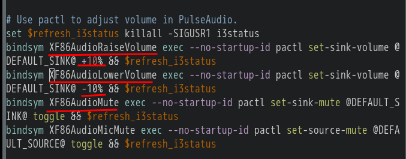

- [[i3]] and [[vim]] move hotkey
  * `jkl;` //i3 默认移动键
  * `hjkl` //vim 默认移动键
  * ***Notice***
  * `$mod+d` //与 horizontal 热键冲突 (请修改 horizontal 的热键，比如：`$mod+semicolon`)
  * `hjkl` //统一 i3 与 vim 移动键
- [[i3]] [[sound]]
  * 修改前  
  * 修改后  
  * ***Notice***
  * `$mod+F10` `+10%` `$mod+F9` `-10%`//音量增加/减少 (请根据你自己电脑的音量键，设置相应的键，你也可以自定义)
  * `mute` `$mod+F11` //静音键 (同上，mute: 沉默的)
- [[logseq]]上传文件
  * `/Upload an asset` //上传文件 (在 logseq 中输入此命令)
- [[i3]] [[screenshot]]
  * `bindsym Print exec flameshot gui` //开启截图 (如果没有 flameshot 的话，请安装 flameshot)
- [[i3]] [[gaps]]
  ```
  for_window [class="^.*"] border pixel 6 //隐藏窗口标题栏，并设置窗口边框像素（可以自定义数字）
  gaps inner 5 //相邻 window（窗口）之间的距离
  gaps outer 0 //window（窗口）与屏幕边缘之间的距离
  smart_gaps on //如果 workspace（工作空间）只有一个 window（窗口），将禁用 gaps（间隙）
  ```
-