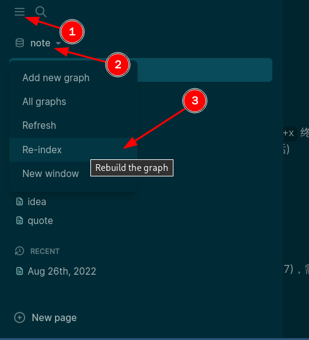

- [[i3]]锁屏
  * `i3lock` //锁定屏幕 (在终端输入)
  * ***注意事项***
  * `bindsym $mod+x exec i3lock` //绑定快捷键 `$mod+x` 终端执行 `i3lock` (当然，你可以绑定快捷键并自定义，如果你喜欢的话)
- 安卓模拟器 (future，有需求再尝试) #idea
  * anbox
  * waydroid
- [[logseq]]`crtl + k`检索
  * `ctrl + k` //检索
  * ***注意事项***
  * `Re-index` //Rebuild the graph (目前(2022-08-27)检索前，需要手动重建图，否则最近的更新，检索不出来)
  * ***参考资料***
  * 
- >光年：光在宇宙真空中沿直线传播了**一年时间**所经过的**距离**
  * ***注意事项***
  * 地球上用到的距离单位(毫米、厘米、分米、米、千米、天文单位)用来衡量宇宙空间太小，所以有了光年这个距离单位
  * ***参考资料***
  * [什么是光年？-科普100问-湖北科普网](http://www.hast.org.cn/kpw/201809/t4159176.shtml) #quote
-