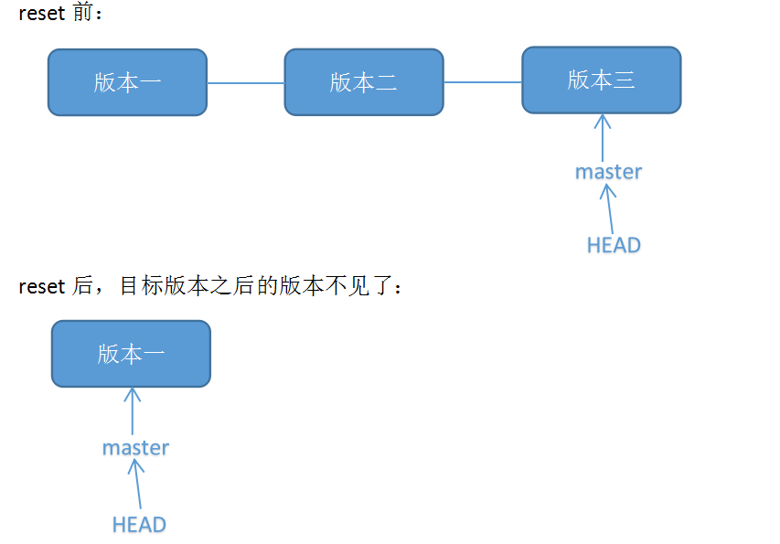

- [[python]]文件名、文件夹名命名约定
  * `hello_world.py` # 文件名命名约定
  * ***注意事项***
  * `hello` `world` # 小写字母
  * `_` # 下划线代替空格
  * ***参考资料***
  * 
  * [Python编程：从入门到实践 (第2版) .pdf](https://www.aliyundrive.com/drive/folder/61b869cf0c818f983d684373a64fbabd93f5ca7c)
- 从他人对大学生活的吐槽中，了解了 #idea
  * 破一本，强制的活动、班会、会议 # 没有任何意义，除了浪费精力
  * ***参考资料***
  * 
  * [吐槽一下大学生活的近况 - 生活](https://www.chongbuluo.com/forum.php?mod=viewthread&tid=11022)
- [[Git]]查看提交历史 # 应用场景：查看 commit sha 值
  * `git log` # 查看提交历史
  * ***参考资料***
  *  
  * [Git - 查看提交历史](https://git-scm.com/book/zh/v2/Git-%E5%9F%BA%E7%A1%80-%E6%9F%A5%E7%9C%8B%E6%8F%90%E4%BA%A4%E5%8E%86%E5%8F%B2)
- [[Git]] `reset` 恢复之前的某个版本 # 应用场景：恢复后，此版本之后的版本舍弃
  * `git reset --hard 8172b02` # reset `8172b02......` 这个版本
  * ***注意事项***
  * `git log` # 查看版本号 (在 `reset` 之前) (版本号举例：`8172b02`)
  * `git push -f` 强制推送 (在 `reset` 之后)
  * ***参考资料***
  *  
  *  
  * [Git 恢复之前版本的两种方法 reset, revert (图文详解)](https://blog.csdn.net/yxlshk/article/details/79944535)
- [[Git]] `revert` 恢复之前的某个版本 # 应用场景：恢复后，此版本之后的版本保留，并创建一个新的版本
  * `git revert -n 版本号` # 恢复版本号
  * ***注意事项***
  * `git log` # 查看版本号 (在 `revert` 之前)
  * `git commit -m '注释'` # 提交注释 (在 `revert` 之后)
  * `git push` # 推送 (在 `commit` 之后)
  * ***参考资料***
  *  
  * [Git 恢复之前版本的两种方法 reset, revert (图文详解)](https://blog.csdn.net/yxlshk/article/details/79944535)
- 快速浏览，不用理解 # 第一部分_基础知识
-