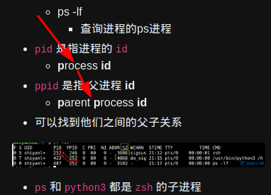

- [[linux]] `ls -lh`命令
  * `ls` # list (动词：列出)
  * `-lh` # 参数
  * `l` # list (名词：列表)
  * `h` # human readable (人类可读)
  * ***参考资料***
  * 
- [[linux]] `chmod u+x sleep.py` 命令
  * `chmod` # change mode (切换模式)
  * `u` # user (当前用户)
  * `+x` # 增加 execute (执行) 权限
  * `sleep.py` # 文件名
  * ***参考资料***
  * 
- [[linux]] `/usr/bin` 含义
  * `usr` # unix software resources (unix 软件资源)
  * `bin` # binary (二进制)
  * ***参考资料***
  * 
- [[linux]] `chmod a+x /usr/bin/sleep.py` 命令
  * `a+x` # all (全部) (所有用户和组)
  * ***参考资料***
  * 
- [[vim]] `o`
  * `o` # 在当前行下方，插入一个新行，并进入编辑模式 (在普通模式下，按 `o` (小写字母))
  * ***参考资料***
  * 
- [[linux]] `~/.zshrc` 含义
  * `~` # 等价于 `/home/你的用户名` (当前用户的用户文件夹)
  * `/` # `/home/你的用户名/` (在这里，指当前目录下)
  * `.` # 隐藏文件 (可以使用 `ls -a` 查看包括隐藏文件的所有文件)
  * `zsh` # shell 是 zsh
  * `rc` # `run commands`
  * ***参考资料***
  * 
- [[linux]] `source ~/.zshrc`
  * `source ~/.zshrc` # 手动运行 `~/.zshrc`
  * ***参考资料***
  * 
- [[linux]] `pid` `ppid` 含义
  * `pid` # p:process (进程)
  * `ppid` # p:parent (父母) p:process (进程)
  * ***参考资料***
  * 
- 测试 csv 转 markdown v1.0.0
  | 关于耀拟计划 & 免责声明               |  |              |  |                    |  |              |
  |---------------------------------------|--|--------------|--|--------------------|--|--------------|
  | - 时间就是金钱，效率就是生命 -        |  |              |  |                    |  |              |
  | 000 - 自我提升                        |  |              |  | 400 - 生活         |  |              |
  | 行动管理                              |  | 阿里云盘链接 |  | 生活管理           |  | 阿里云盘链接 |
  | 时间管理                              |  | 阿里云盘链接 |  | 形象提升           |  | 阿里云盘链接 |
  | 学习效率                              |  | 阿里云盘链接 |  | 健康养生           |  | 阿里云盘链接 |
  | 文笔口才                              |  | 阿里云盘链接 |  | 餐饮美食           |  | 阿里云盘链接 |
  | 思维认知                              |  | 阿里云盘链接 |  | 商业知识           |  | 阿里云盘链接 |
  | 为人处事                              |  | 阿里云盘链接 |  | 情感两性           |  | 阿里云盘链接 |
  | 100 - 幼儿到高中学习资料              |  |              |  | 兴趣爱好           |  | 阿里云盘链接 |
  | 幼儿教育                              |  | 阿里云盘链接 |  | 500 - 文学修养     |  |              |
  | 小学初中教育                          |  | 阿里云盘链接 |  | 人物传记           |  | 阿里云盘链接 |
  | 高中教育                              |  | 阿里云盘链接 |  | 演讲演说           |  | 阿里云盘链接 |
  | 200 - 计算机编程教程                  |  |              |  | 传统国学           |  | 阿里云盘链接 |
  | 计算机基础                            |  | 阿里云盘链接 |  | 600 - 职场相关     |  |              |
  | Python                                |  | 阿里云盘链接 |  | 职场竞争力         |  | 阿里云盘链接 |
  | Web前端                               |  | 阿里云盘链接 |  | 领导能力           |  | 阿里云盘链接 |
  | Android                               |  | 阿里云盘链接 |  | 项目管理           |  | 阿里云盘链接 |
  | 300 - 软件教程                        |  |              |  | 平面设计           |  | 阿里云盘链接 |
  | PPT教程                               |  | 阿里云盘链接 |  | 人力资源           |  | 阿里云盘链接 |
  | Word教程                              |  | 阿里云盘链接 |  | 自媒体营销         |  | 阿里云盘链接 |
  | Excel教程                             |  | 阿里云盘链接 |  | 文案写作           |  | 阿里云盘链接 |
  | PS教程                                |  | 阿里云盘链接 |  | 各种模板           |  | 阿里云盘链接 |
  | PR教程                                |  | 阿里云盘链接 |  | 700 - 各类考证资料 |  |              |
  | 摄影教程                              |  | 阿里云盘链接 |  | 公务员考试         |  | 阿里云盘链接 |
  | 思维导图教程                          |  | 阿里云盘链接 |  | 驾考资料           |  | 阿里云盘链接 |
  | Anki教程                              |  | 阿里云盘链接 |  |                    |  | 阿里云盘链接 |
  | Powered by 凉风习~又一秋! v2021.12.12 |  |              |  |                    |  |              |
- 测试 vsc 转 markdown v1.0.1
  | 关于耀拟计划 & 免责声明               |              |  |                    |              |
  |---------------------------------------|--------------|--|--------------------|--------------|
  | - 时间就是金钱，效率就是生命 -        |              |  |                    |              |
  | 000 - 自我提升                        |              |  | 400 - 生活         |              |
  | 行动管理                              | 阿里云盘链接 |  | 生活管理           | 阿里云盘链接 |
  | 时间管理                              | 阿里云盘链接 |  | 形象提升           | 阿里云盘链接 |
  | 学习效率                              | 阿里云盘链接 |  | 健康养生           | 阿里云盘链接 |
  | 文笔口才                              | 阿里云盘链接 |  | 餐饮美食           | 阿里云盘链接 |
  | 思维认知                              | 阿里云盘链接 |  | 商业知识           | 阿里云盘链接 |
  | 为人处事                              | 阿里云盘链接 |  | 情感两性           | 阿里云盘链接 |
  | 100 - 幼儿到高中学习资料              |              |  | 兴趣爱好           | 阿里云盘链接 |
  | 幼儿教育                              | 阿里云盘链接 |  | 500 - 文学修养     |              |
  | 小学初中教育                          | 阿里云盘链接 |  | 人物传记           | 阿里云盘链接 |
  | 高中教育                              | 阿里云盘链接 |  | 演讲演说           | 阿里云盘链接 |
  | 200 - 计算机编程教程                  |              |  | 传统国学           | 阿里云盘链接 |
  | 计算机基础                            | 阿里云盘链接 |  | 600 - 职场相关     |              |
  | Python                                | 阿里云盘链接 |  | 职场竞争力         | 阿里云盘链接 |
  | Web前端                               | 阿里云盘链接 |  | 领导能力           | 阿里云盘链接 |
  | Android                               | 阿里云盘链接 |  | 项目管理           | 阿里云盘链接 |
  | 300 - 软件教程                        |              |  | 平面设计           | 阿里云盘链接 |
  | PPT教程                               | 阿里云盘链接 |  | 人力资源           | 阿里云盘链接 |
  | Word教程                              | 阿里云盘链接 |  | 自媒体营销         | 阿里云盘链接 |
  | Excel教程                             | 阿里云盘链接 |  | 文案写作           | 阿里云盘链接 |
  | PS教程                                | 阿里云盘链接 |  | 各种模板           | 阿里云盘链接 |
  | PR教程                                | 阿里云盘链接 |  | 700 - 各类考证资料 |              |
  | 摄影教程                              | 阿里云盘链接 |  | 公务员考试         | 阿里云盘链接 |
  | 思维导图教程                          | 阿里云盘链接 |  | 驾考资料           | 阿里云盘链接 |
  | Anki教程                              | 阿里云盘链接 |  |                    | 阿里云盘链接 |
- 测试 csv 转 markdown v1.0.2
  |                                       |  |                    |
  |:-------------------------------------:|--|:------------------:|
  | 000 - 自我提升                        |  | 400 - 生活         |
  | 行动管理                              |  | 生活管理           |
  | 时间管理                              |  | 形象提升           |
  | 学习效率                              |  | 健康养生           |
  | 文笔口才                              |  | 餐饮美食           |
  | 思维认知                              |  | 商业知识           |
  | 为人处事                              |  | 情感两性           |
  | 100 - 幼儿到高中学习资料              |  | 兴趣爱好           |
  | 幼儿教育                              |  | 500 - 文学修养     |
  | 小学初中教育                          |  | 人物传记           |
  | 高中教育                              |  | 演讲演说           |
  | 200 - 计算机编程教程                  |  | 传统国学           |
  | 计算机基础                            |  | 600 - 职场相关     |
  | Python                                |  | 职场竞争力         |
  | Web前端                               |  | 领导能力           |
  | Android                               |  | 项目管理           |
  | 300 - 软件教程                        |  | 平面设计           |
  | PPT教程                               |  | 人力资源           |
  | Word教程                              |  | 自媒体营销         |
  | Excel教程                             |  | 文案写作           |
  | PS教程                                |  | 各种模板           |
  | PR教程                                |  | 700 - 各类考证资料 |
  | 摄影教程                              |  | 公务员考试         |
  | 思维导图教程                          |  | 驾考资料           |
  | Anki教程                              |  |                    |
- 测试 csv 转 markdown v1.0.3
  |                                       |                    |
  |:-------------------------------------:|:------------------:|
  | **000 - 自我提升**                    | **400 - 生活**     |
  | 行动管理                              | 生活管理           |
  | 时间管理                              | 形象提升           |
  | 学习效率                              | 健康养生           |
  | 文笔口才                              | 餐饮美食           |
  | 思维认知                              | 商业知识           |
  | 为人处事                              | 情感两性           |
  | **100 - 幼儿到高中学习资料**          | 兴趣爱好           |
  | 幼儿教育                              | **500 - 文学修养** |
  | 小学初中教育                          | 人物传记           |
  | 高中教育                              | 演讲演说           |
  | **200 - 计算机编程教程**              | 传统国学           |
  | 计算机基础                            | **600 - 职场相关** |
  | Python                                | 职场竞争力         |
  | Web前端                               | 领导能力           |
  | Android                               | 项目管理           |
  | **300 - 软件教程**                    | 平面设计           |
  | PPT教程                               | 人力资源           |
  | Word教程                              | 自媒体营销         |
  | Excel教程                             | 文案写作           |
  | PS教程                                | 各种模板           |
  | PR教程                                |**700 - 各类考证资料**|
  | 摄影教程                              | 公务员考试         |
  | 思维导图教程                          | 驾考资料           |
  | Anki教程                              |                    |
- 测试 csv 转 markdown v1.0.4
  |                                                         |                                                     |                                                     |
  |:-------------------------------------------------------:|:---------------------------------------------------:|:---------------------------------------------------:|
  |**------ 自我提升 ------**                               |**------ 软件教程 ------**                           |  **------ 文学修养 ------**                         |                  
  |[行动管理](https://www.aliyundrive.com/s/keRVra9mtad)    |[PPT](https://www.aliyundrive.com/s/gS47adUV8do)     |[人物传记](https://www.aliyundrive.com/s/fH3e5fLTT9N)|                  
  |[时间管理](https://www.aliyundrive.com/s/1nNrmzRwHJQ)    |[World](https://www.aliyundrive.com/s/tDquMiTfYah)   |[演讲演说](https://www.aliyundrive.com/s/b7YY5fHFQcT)|                  
  |[学习效率](https://www.aliyundrive.com/s/6vgBZbNuE7B)    |[Excel](https://www.aliyundrive.com/s/AHKhn3jKyj9)   |[传统国学](https://www.aliyundrive.com/s/u7RLQphh4kK)|                  
  |[文笔口才](https://www.aliyundrive.com/s/mVzUeFPvynk)    |[PS](https://www.aliyundrive.com/s/QJ24Zzd593T)      |  **------ 职场相关 ------**  |                  
  |[思维认知](https://www.aliyundrive.com/s/i6Ljb7UBpfj)    |[PR](https://www.aliyundrive.com/s/69Uz6AP8bib)      |[职场竞争力](https://www.aliyundrive.com/s/ztrSkNX2rcY)|                  
  |[为人处事](https://www.aliyundrive.com/s/kqnPnRzRe87)    |[摄影](https://www.aliyundrive.com/s/ZsDyJejTf6q)    |[领导能力](https://www.aliyundrive.com/s/Y28EmpFgUj4)|                  
  |**- 幼儿到高中学习资料 -**                               |[思维导图](https://www.aliyundrive.com/s/nGYJMkFcvb4)|[项目管理](https://www.aliyundrive.com/s/Nc9pEyK4Yxz)|                  
  |[幼儿教育](https://www.aliyundrive.com/s/oAsnmMRy5Wr)    |[Anki](https://www.aliyundrive.com/s/VzoUTZn2Ref)    |[平面设计](https://www.aliyundrive.com/s/f8UgcVDA5Sj)|                    
  |[小学初中教育](https://www.aliyundrive.com/s/ouqWtmdtRyK)|**-------- 生活 --------**                           |[人力资源](https://www.aliyundrive.com/s/SmFWT9EpooX)| 
  |[高中教育](https://www.aliyundrive.com/s/a9UyTthzaRS)    |[生活管理](https://www.aliyundrive.com/s/8GpUYfBebm3)|[自媒体营销](https://www.aliyundrive.com/s/R1MFohENhxM)| 
  |**--- 计算机编程教程 ---**                               |[形象提升](https://www.aliyundrive.com/s/7bLqTKrRGEW)|[文案写作](https://www.aliyundrive.com/s/Rng1XpTcNnP)| 
  |[计算机基础](https://www.aliyundrive.com/s/k7BcpiMbpgQ)  |[健康养生](https://www.aliyundrive.com/s/45CMWsbaDc8)|[各种模板](https://www.aliyundrive.com/s/1xpmpgTDF8t)| 
  |[Python](https://www.aliyundrive.com/s/XmEsDZd9HoT)      |[餐饮美食](https://www.aliyundrive.com/s/WaQYnnMVgkY)|**---- 各类考证资料 ----**| 
  |[Web前端](https://www.aliyundrive.com/s/WwaxvMHe4Bh)     |[商业知识](https://www.aliyundrive.com/s/TpDCTAvydFS)|[公务员考试](https://www.aliyundrive.com/s/akGhEbsPr3q)| 
  |[Android](https://www.aliyundrive.com/s/h8L4uCjQCgM)     |[情感两性](https://www.aliyundrive.com/s/jq36xkW12vp)|[驾考资料](https://www.aliyundrive.com/s/Cwmk6zsE3xT)| 
  |                                                         |[兴趣爱好](https://www.aliyundrive.com/s/G575najSduc)|                      |
-