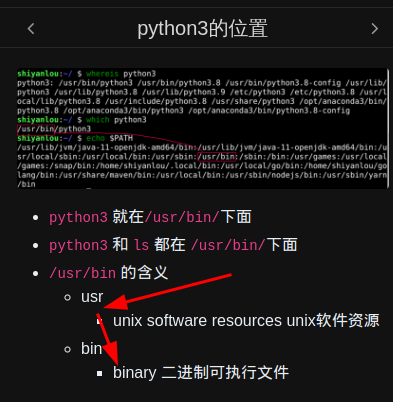
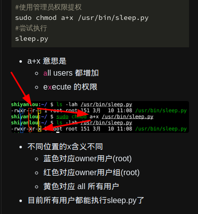

- [[linux]] `ls -lh`命令
  * `ls` # list (动词：列出)
  * `-lh` # 参数
  * `l` # list (名词：列表)
  * `h` # human readable (人类可读)
  * ***参考资料***
  * 
- [[linux]] `chmod u+x sleep.py` 命令
  * `chmod` # change mode (切换模式)
  * `u` # user (当前用户)
  * `+x` # 增加 execute (执行) 权限
  * `sleep.py` # 文件名
  * ***参考资料***
  * 
- [[linux]] `/usr/bin` 含义
  * `usr` # unix software resources (unix 软件资源)
  * `bin` # binary (二进制)
  * ***参考资料***
  * 
- [[linux]] `chmod a+x /usr/bin/sleep.py` 命令
  * `a+x` # all (全部) (所有用户和组)
  * ***参考资料***
  * 
-