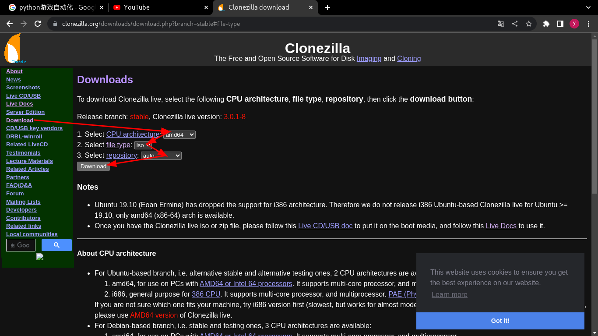

- [[linux]] check SHA256
  * `sha256sum filename` # check SHA256 of filename. (for example: `sha256sum clonezilla-live-3.0.1-8-amd64.iso`)
  * ***References***
  * 
  * `man sha256sum`
  * 
- [[linux]] backup and restore os with clonezilla
  * 
  * 
  * ***References***
  * [# VLOG 28 | 【电脑小技巧】如何使用 CloneZilla再生龍 来备份操作系统？](https://www.youtube.com/watch?v=SoAE2j4zCEE)
  * [# VLOG 37 | 【电脑小技巧】如何使用CloneZilla再生龙来还原操作系统？](https://www.youtube.com/watch?v=DhGuBl5MPNw)
  * [Clonezilla - About](https://clonezilla.org/)
-