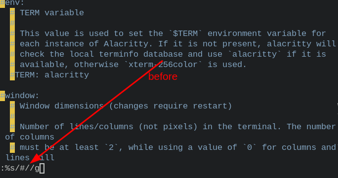
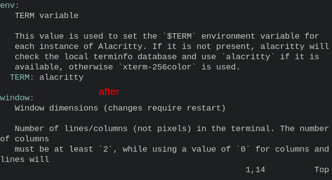
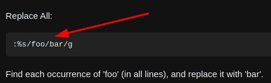

- [[linux]]copy files excluding existing ones
  * `sudo cp -rn ~/kaigua/* ~/test` # `-n` is `--no-clobber` (not overwrite)
  * 
  * 
  * `man cp` # have a problem finding a man
- [[linux]] [[gentoo]]ssh iso # enter code in gentoo iso
  ```
  /etc/init.d/sshd start
  passwd root
  ```
- [[vim]] insert a new line hotkey shotcuts
  * `o` # insert a new line below the cursor (a lowercase letter) (of course, a uppercase letter `O` is above the cursor)
  * ***References***
  * `:help o` # enter it in vim with normal mode.
  * 
  * `vimtutor` # enter it in terminal of shell (But it only has basic commands.)
- * v5.0.0 EFI, linux swap 24GiB, no encryption, /dev/sda, desktop-systemd, gentoo cn mirror, no ~amd64, run mirrorselect, screenfetch, vim, i3-gaps, sddm # install compelete.
  * v4.0.0 EFI, linux swap, no encryption, /dev/sda, systemd, gentoo cn mirror, no ~amd64, run mirrorselect, screenfetch # install compelete.
  * v3.1.0 the first lower link: git clone --depth 1 https://anongit.gentoo.org/git/repo/sync/gentoo.git 100KiB/s
  * v3.0.0 bios, linux swap, no encryption, /dev/sda, openrc, gentoo cn mirror, no ~amd64, run mirrorselect, screenfetch # install compelete.
  * v2.2.0 stage3 # don't need desktop (i3) (It will need a lot of time to compiling rust. So i3 need desktop.)
  * v2.1.0 emerge --verbose sys-kernel/dracut sys-kernel/gentoo-kernel-bin app-arch/zstd # Command Failed
  * v2.0.0 git mirrors: https://mirrors.ustc.edu.cn/gentoo.git; gentoo mirrors: https://mirrors.ustc.edu.cn/gentoo/; not run select gentoo mirrors # speed is faster than 1.
  * v1.0.0 git mirrors: default; gentoo mirrors: https://mirrors.ustc.edu.cn/gentoo/ run select gentoo mirrors # speed is lower, 100KiB/s (lower first link: git clone --depth1 https://anongit.gentoo.org/git/repo/sync/gentoo.git)
  * ***References***
  * https://www.youtube.com/watch?v=I-vu9IHHYLg # install gentoo finish
  * https://github.com/oddlama/gentoo-install
  * v0.0.0 gentooinstall test
- [[vim]]replace all
  * `:%s/#//g` # find "#", and replace it with ""
  * ***References***
  *  
  *  
  * 
  * [Find and replace strings in vim on multiple lines](https://stackoverflow.com/questions/19994922/find-and-replace-strings-in-vim-on-multiple-lines)
-