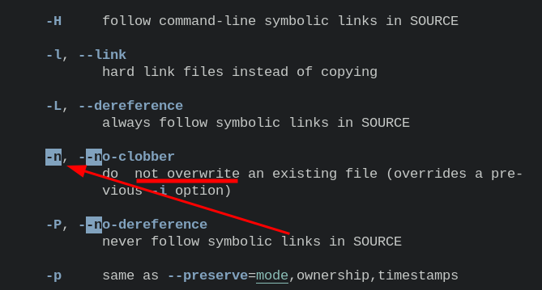

- [[linux]]copy files excluding existing ones
  * `sudo cp -rn ~/kaigua/* ~/test` # `-n` is `--no-clobber` (not overwrite)
  * 
  * 
  * `man cp` # have a problem finding a man
- [[linux]] [[gentoo]]ssh iso # enter code in gentoo iso
  ```
  /etc/init.d/sshd start
  passwd root
  ```
- [[vim]] insert a new line hotkey shotcuts
  * `o` # insert a new line below the cursor (a lowercase letter) (of course, a uppercase letter `O` is above the cursor)
  * ***References***
  * `:help o` # enter it in vim with normal mode.
  * 
  * `vimtutor` # enter it in terminal of shell (But it only has basic commands.)
-