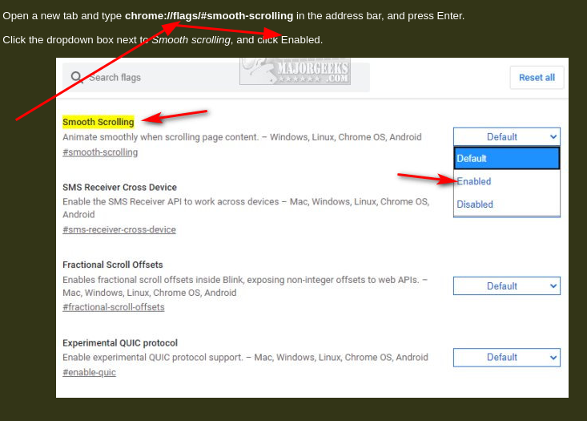

- [[vimium]]temporarily disable vimium
  * `i` # ignore all commands of vimium by hitting this key (`i` is `insert`)
  * ***Notes***
  * `esc` # exit and enable vimium by hitting this key
  * ***References***
  * 
  * [philc/vimium: The hacker's browser.](https://github.com/philc/vimium)
- [[browser]]chrome disable smooth scrolling
  * `about:flags` # search "scroll" and click "Disabled" after you type them in browser address bar
  * ***References***
  * 
  * 
  * [How to Enable or Disable Smooth Scrolling in Google Chrome](https://www.majorgeeks.com/content/page/how_to_enable_or_disable_smooth_scrolling_in_google_chrome.html)
  * [Experiments](chrome://flags/)
-