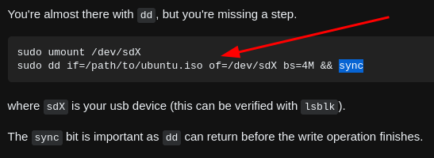

- [[usb]]dd iso to usb
  id:: 633a2eab-db08-48a3-84e9-d56ac6ec563b
  * `sudo dd if=/home/gentoo/Downloads/ubuntu-22.04.1-live-server-amd64.iso of=/dev/sdc bs=4M && sync`
  * ***Notes***
  * `/dev/sdc` # your usb device (`lsblk` can view it)
  * `sync` # If you don't do this, you will get an "Operating System not Found"error.
  * ***References***
  * 
  * 
  * 
  * [How to create a bootable Ubuntu USB flash drive form terminal?](https://askubuntu.com/questions/372607/how-to-create-a-bootable-ubuntu-usb-flash-drive-from-terminal)
- I need to spend a lot of time cleaning the HP laptop (e.g. electric fan, GPU, etc.) because it has a lot of screws. #Idea
  
  * ***References***
  * [HP 1000 Laptop Disassembly | Fan Cleaning | Replace Parts](https://www.youtube.com/watch?v=p7XZNsNLQss)
- docker test
  * 
-