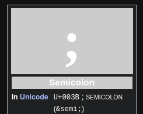
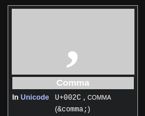
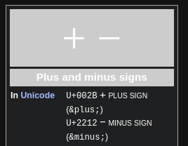

- [[symbol]]semicolon or semi-colon `;`
  * ***References***
  * 
  * [Semicolon - Wikipedia](https://en.wikipedia.org/wiki/Semicolon)
- [[symbol]]comma `,`
  * ***References***
  * 
  * [Comma - Wikipedia](https://en.wikipedia.org/wiki/Comma)
- [[symbol]]asterisk `*`
  * ***References***
  * 
  * [Asterisk - Wikipedia](https://en.wikipedia.org/wiki/Asterisk)
- [[symbol]]minus `-`
  * ***References***
  * 
  * [Plus and minus signs - Wikipedia](https://en.wikipedia.org/wiki/Plus_and_minus_signs)
- [[symbol]]greater-than sign `>`
  * ***References***
  * 
  * [Greater-than sign - Wikipedia](https://en.wikipedia.org/wiki/Greater-than_sign)
-