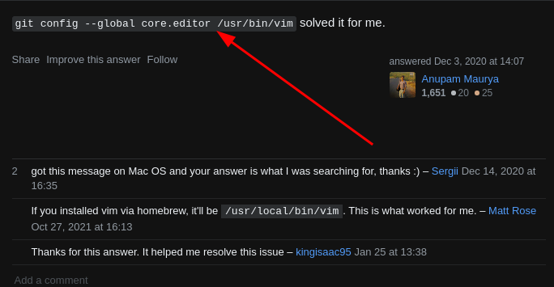

- [[HTML]] Declaration
  ```html
  <!DOCTYPE html>
  ```
  * ***Notes***
  * `<!DOCTYPE html>` # Declaration for HTML5
  * ***References***
  * 
  * [HTML Basic](https://www.w3schools.com/html/html_basic.asp)
- [[HTML]] Heading
  ```html
  <h1>This is heading 1</h1>
  ```
  * ***Notes***
  * `h` # Heading
  * `<h1>` # Heading 1 tag
  * ***References***
  * 
  * 
  * [HTML Basic](https://www.w3schools.com/html/html_basic.asp)
- [[HTML]] Paragraph
  ```html
  <p>This is a paragraph.</p>
  ```
  * ***Notes***
  * `p` # Paragraph
  * ***References***
  * 
  * 
  * [HTML](https://www.w3schools.com/html/html_basic.asp)
- [[HTML]] Link
  ```html
  <a href="https://github.com/yaoniplan/note">yaoniplan</a>
  ```
  * ***Notes***
  * `a` # anchor
  * `href` # hyperlink reference
  * ***References***
  * 
  * 
  *  
  * [Links and Images | The Odin Project](https://www.theodinproject.com/lessons/foundations-links-and-images)
- [[HTML]] Image
  ```html
  
  ```
  * ***Notes***
  * `img` # image
  * `src` # source
  * `alt` # alternative text
  * ***References***
  *  
  * 
  * 
  * 
  * [HTML Basic](https://www.w3schools.com/html/html_basic.asp)
  * [Links and Images | The Odin Project](https://www.theodinproject.com/lessons/foundations-links-and-images)
- [[HTML]] A line break
  ```html
  <p>This is a <br> paragraph with a line break.</p>
  ```
  * ***Notes***
  * `br` # break
  * ***References***
  *  
  * 
  * [HTML Elements](https://www.w3schools.com/html/html_elements.asp)
- [[HTML]] Attribute `name="value"`
  * ***References***
  * 
  * 
  * 
  * 
  * 
  * 
  * 
  * 
  * 
  * 
  * [HTML Attributes](https://www.w3schools.com/html/html_attributes.asp)
- [[HTML]] Horizontal rule `hr`
  * ***References***
  * 
  * 
  * [HTML Paragraphs](https://www.w3schools.com/html/html_paragraphs.asp)
- [[HTML]] Style attribute
  ```html
  <tagname style="property:value;">
  ```
  * ***Notes***
  * `property` # a CSS property
  * `value` # a CSS value
  * ***References***
  * 
  * 
  * 
  * 
  * 
  * 
  * 
  * 
  * 
  * 
  * 
  * 
  * 
- [[vim]]replace all
  * `:%s/\[\[//g` # find "[[" and replace it with ""
  * ***Notes***
  * `\` # escape character, you should add it when you have "Pattern not found" problem
  * ***References***
  * 
  * 
  * 
- [[HTML]]Bold `<b>`
  ```html
  <b>This text is bold</b>
  ```
  * ***References***
  * 
- [[HTML]]Strong importance `<strong>`
  ```html
  <strong>This text is important</strong>
  ```
  * ***References***
  * 
- [[HTML]]Italic `<i>`
  ```html
  <i>This text is italic</i>
  ```
  * ***References***
  * 
- [[HTML]]Emphasized `<em>`
  ```html
  <em>This text is emphasized</em>
  ```
  * ***References***
  * 
- [[HTML]]Smaller `<small>`
  ```html
  <small>This is some smaller text</small>
  ```
  * ***References***
  * 
- [[HTML]]Marked `<mark>`
  ```html
  Do not forget to buy <mark>milk</mark> today
  ```
  * ***References***
  * 
- [[HTML]]Deleted `<del>`
  ```html
  My favorite color is <del>blue</del> red
  ```
  * ***References***
  * 
- [[HTML]]Inserted `<ins>`
  ```html
  My favorite color is <del>blue</del> <ins>red</ins>
  ```
  * ***References***
  * 
- [[HTML]]Subscripted `<sub>`
  ```html
  This is <sub>subscripted</sub> text (e.g. H<sub>2</sub>O)
  ```
  * ***References***
  * 
- [[Git]]edit comments
  * `git commit --amend`
  * ***Notes***
  * `git config --global core.editor /usr/bin/vim` # When you have an error about editor (e.g. /bin/nano)
  * ***References***
  * 
  * 
  * 
  * [How can I fix git commit error "Waiting for your editor to close the file..." with Vs Code? - Stack Overflow](https://stackoverflow.com/questions/52195877/how-can-i-fix-git-commit-error-waiting-for-your-editor-to-close-the-file-wi)
-