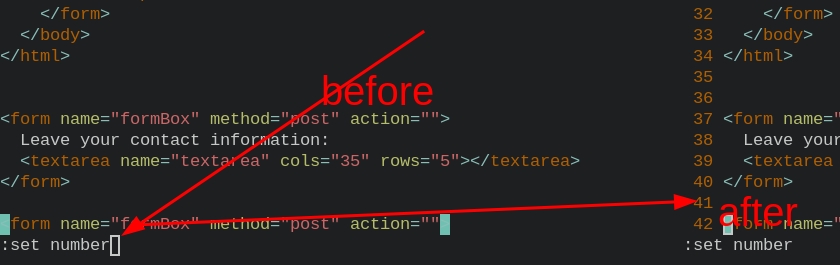
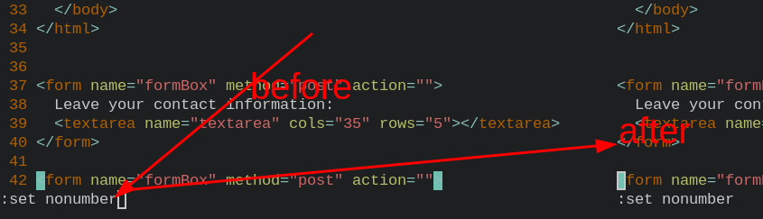
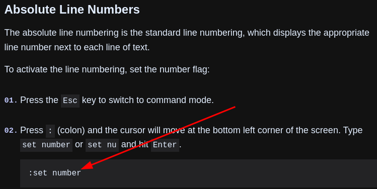

- [[HTML]]Superscripted `<sup>`
  ```html
  This is <sup>superscripted</sup> text (e.g. WWW<sup>[1]</sup>)
  ```
  * ***References***
  * 
- [[HTML]]Abbreviation `<abbr>`
  ```html
  The <abbr title="World Health Organization">WHO</abbr> was founded in 1948
  ```
  * ***References***
  * 
- [[HTML]]Address `<address>`
  ```html
  <address>
  Written by Yaoniplan<br>
  Visit us at:<br>
  Github.com/yaoniplan<br>
  Fuzhou, Jiangxi<br>
  China
  </address>
  ```
  * ***References***
  * 
- [[HTML]]Comments
  ```html
  <!-- Write your comments here -->
  ```
  * ***References***
  * 
- [[HTML]]Colors background
  ```html
  <h1 style="background-color:Tomato;">Hello Yaoniplan</h1>
  ```
  * ***References***
  * 
- [[HTML]]Colors text
  ```html
  <h3 style="color:Tomato;">Hello Yaoniplan</h3>
  ```
  * ***References***
  * 
- [[HTML]]Colors border
  ```html
  <h1 style="border:2px solid Tomato;">Hello Yaoniplan</h1>
  ```
  * ***References***
  * 
- [[HTML]]Colors RGB
  ```html
  <h1 style="background-color:rgb(255, 0, 0);">Hello Yaoniplan</h1>
  ```
  * ***Notes***
  * `255``0` # intensity (between 0 and 255) of the color
  * `(255, 0, 0)` # (red, green, blue)
  * `rgb(0, 0, 0)` # black
  * `rgb(255, 255, 255)` # white
  * ***References*** 
  *  
  * 
  * [HTML RGB and RGBA Colors](https://www.w3schools.com/html/html_colors_rgb.asp)
- [[HTML]]Colors RGBA
- [[HTML]]Colors RGBA
  ```html
  <h1 style="background-color:rgba(255, 0, 0, 0.0);">Hello Yaoniplan</h1>
  ```
  * ***Notes***
  * `a` # alpha
  * `0.0` # the opacity of the color
  * `1.0` # not transparent at all
  * ***References***
  *  
  * 
  * [HTML RGB and RGBA Colors](https://www.w3schools.com/html/html_colors_rgb.asp)
- [[HTML]]Colors HEX
  ```html
  #rrggbb
  ```
  * ***Notes***
  * `HEX` # Hexadecimal
  * `rr` # red
  * `gg` # green
  * `bb` # blue
  * `00``ff` # between 00 and ff (same as decimal 0-255)
  * ***References***
  * 
  *  
  * [HTML HEX Colors](https://www.w3schools.com/html/html_colors_hex.asp)
- [[Vim]]Line number show
  * `:set number`
  * ***Notes***
  * `:set nonumber` # Line number hide
  * ***References***
  *  
  *  
  * 
  * [How to Show Line Numbers in Vim / Vi | Linuxize](https://linuxize.com/post/how-to-show-line-numbers-in-vim/)
-