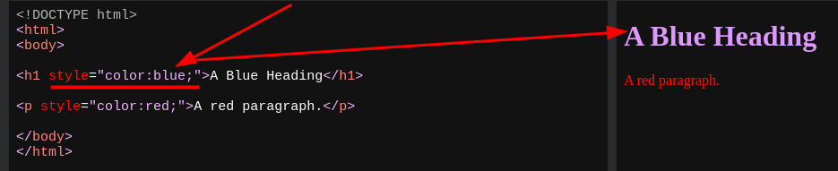

- [[HTML]]Cascading Style Sheets `CSS`
  * ***References***
  * 
  * [HTML Styles CSS](https://www.w3schools.com/html/html_css.asp)
- [[HTML]]CSS Inline
  ```html
  <h1 style="color:blue;">A blue Heading</h1>
  <p style="color:red;">A red paragraph.</p>
  ```
  * ***References***
  * 
  * 