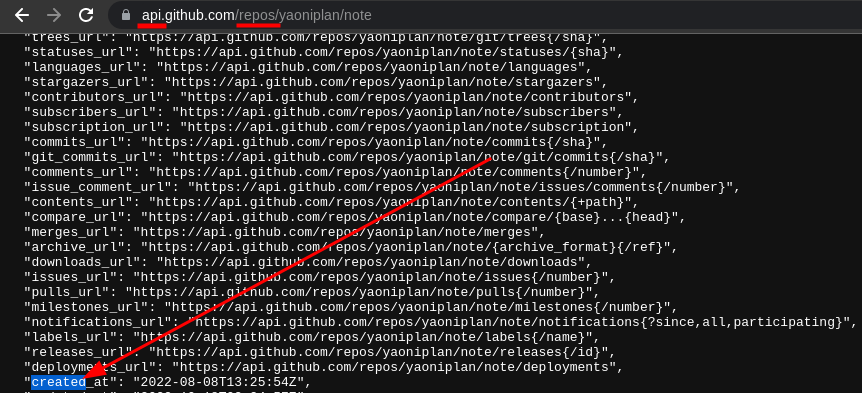

- [[Github]]repository created time (date)
	- `https://api.github.com/repos/yaoniplan/note`
- ***Notes***
	- `api.` # Add it before the "github.com/"
	- `repos/` # Add it after the "github.com/"
- ***References***
	- 
	- 
	- [How To Check Creation Date for Any GitHub Repository](https://www.ilovefreesoftware.com/16/programming/check-creation-date-github-repository.html)
- ---
-