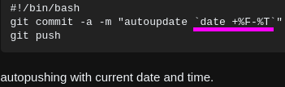
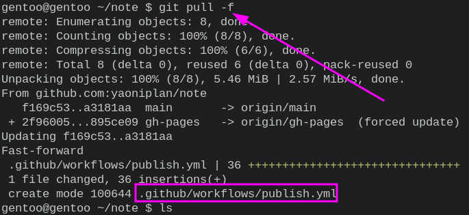

- Push using [[Git]] automatically
	- "~/.config/shell/autoGit.sh"
	  ```sh
	  #!/bin/sh
	  while :
	  do
	    cd ~/note
	    sleep 20
	    git add *
	    sleep 20
	    git commit -m "Update at `date +%F-%T`"
	    sleep 20
	    git push
	  done
	  ```
	- "~/.config/i3/config"
	  ```
	  # Git automatically
	  exec ~/.config/shell/autoGit.sh
	  ```
- ***Notes***
	- `chmod u+x ~/.config/shell/autoGit.sh` Add executable permission
- ***References***
	- 
	- 
	- 
	- 
	- [Making git auto-commit - Stack Overflow](https://stackoverflow.com/questions/420143/making-git-auto-commit)
- ---
- I'm trying to automate commit and push using [[Git]]. #idea
	- test it using Git hooks
	- write a sh file
	- test sh file about "sleep"
	- test sh file about "sleep" again
	- change sleep 540 to 20
	- It doesn't work about commit message again
	- Change ";" to ":"
- ---
- Set the date and time permanently in [[Linux]]
	- `sudo timedatectl set-time '06:52:00'`
- ***Notes***
	- `sudo timedatectl set-time '2022-11-03 06:57:00'` # If you want to change the date and time
- ***References***
	- 
	- 
	- 
	- [command line - how to set the date & time Permanently - Unix & Linux Stack Exchange](https://unix.stackexchange.com/questions/302754/how-to-set-the-date-time-permanently)
- ---
- I am trying to publish my [[Logseq]]. #idea
	- test the publish function
	- Succeeded
	- https://yaoniplan.github.io/note/
- ---
- Publish [[Logseq]]
	- 
	- 
	- 
	- 
	- 
	- 
- ***Notes***
	- `git pull -f` # After completing the steps in GitHub
- ***References***
	- [pengxiao/logseq-publish action tutorial - YouTube](https://www.youtube.com/watch?v=UYqJcFEYUsY)
	- [knowledge-garden/main.yml at main · pengx17/knowledge-garden](https://github.com/pengx17/knowledge-garden/blob/main/.github/workflows/main.yml)
	- [pengx17/logseq-publish: Logseq Publish Action](https://github.com/pengx17/logseq-publish)