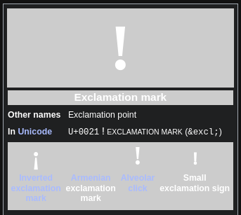

- # Add a [[Abbreviation]]
  Incorporation (`Inc.`)
- ***References***
	- 
- ---
- # Add a [[Abbreviation]]
  Main Character (`MC`) in anime
- ***References***
	- 
- ---
- # Add a [[Punctuation]]
  Exclamation mark (`!`)
- ***References***
	- 
	- [Exclamation mark - Wikipedia](https://en.wikipedia.org/wiki/Exclamation_mark)
- ---
- # Add a [[Punctuation]]
  Space (` `)
- ***References***
	- 
	- [Space (punctuation) - Wikipedia](https://en.wikipedia.org/wiki/Space_(punctuation))
- ---
- I'm trying to refactor Markdown.md in English. #Idea
- ---
- # test typesetting
  Use `headings` `unordered lists` `images` `links` `code`
- ***Notes***
	- test # test
	- test # test
- ***References***
	- test_image
	- test_image
	- test_link