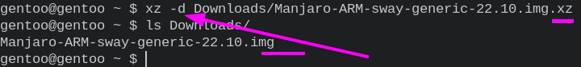
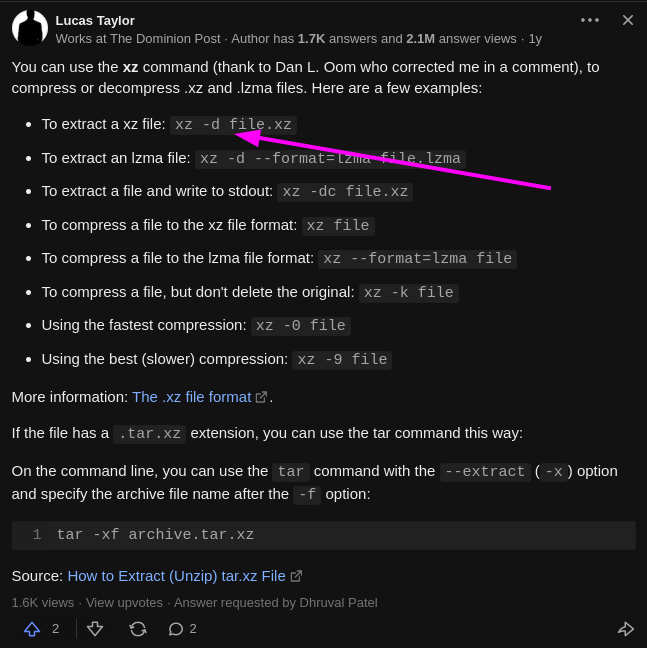

- Usage #Chmod #Linux
	- `sudo chmod -R 777 ~/note/grow/029_googleTranslateExtension2.0.12_0/`
	- ***Notes***
		- `-R` # recursive
		- `777` #
- ---
- Usage #QEMU #Emulation #Gentoo #Linux
	- `sudo qemu-system-x86_64 -display gtk -m 20G -boot d -vga std -cdrom ~/app/archlinux-2022.08.05-x86_64.iso`
		- ***References***
			- 
			- [QEMU/Options - Gentoo Wiki](https://wiki.gentoo.org/wiki/QEMU/Options)
- ---
- Wayland is a **display server protocol** that seeks to replace X11. #Linux #Wayland
	- ***References***
		- 
		- [Why Use Wayland versus X11? | CBT Nuggets](https://www.cbtnuggets.com/blog/technology/networking/why-use-wayland-versus-x11)
- ---
- decompress (extract) `.xz` file #Linux
	- `xz -d Downloads/Manjaro-ARM-sway-generic-22.10.img.xz`
		- ***References***
			- 
			- 
			- [How to extract an XZ file in Linux - Quora](https://www.quora.com/How-do-I-extract-an-XZ-file-in-Linux)