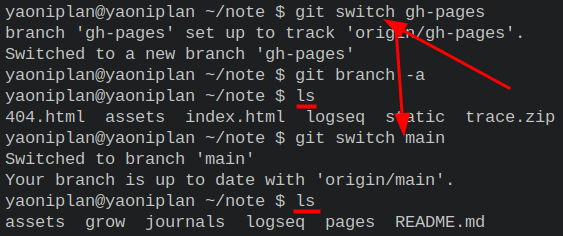
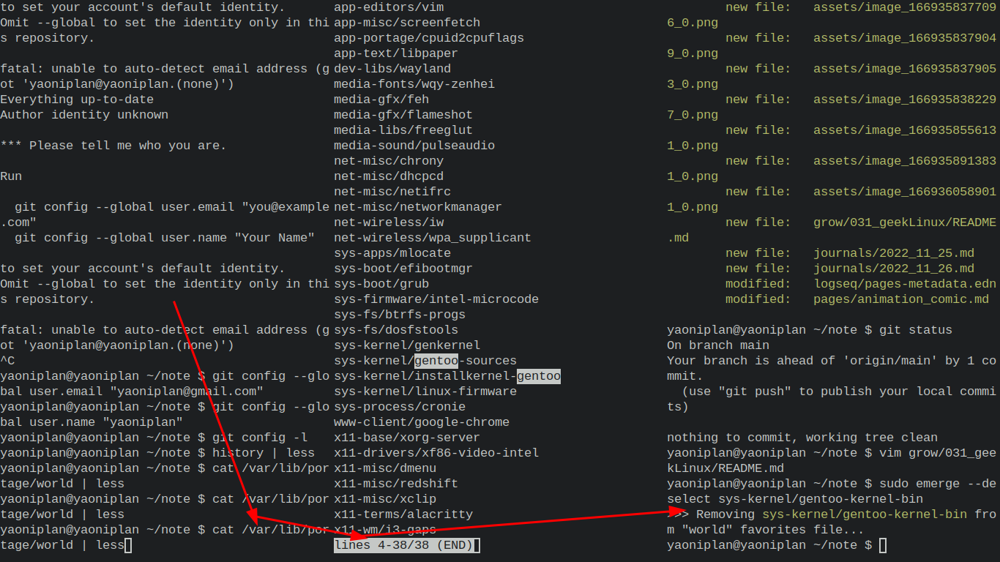

- ---
- SDDM theme #Gentoo #Linux #DM
	- `sudo cp -r ~/sddm-chili-0.1.5 /usr/share/sddm/themes/`
	- `sudo vim /usr/share/sddm/sddm.conf.d/00default.conf`
		- ```
		  [Theme]
		  # Current theme name
		  Current=sddm-chili-0.1.5
		  ```
	- ***Notes***
		- `/usr/share/sddm/sddm.conf.d/00default.conf` # SDDM's config file
			- `sudo updatedb` # Update a database for mlocate
			- `locate sddm.conf` # Locate file including "sddm.conf" text
		- `sudo emerge --ask dev-qt/qtquickcontrols` # Solve an error about *file:///usr/share/sddm/themes/sddm-chili-0.1.5/Main.qml:22:1: module "QtQuick.Controls" is not installed*
		- `sudo emerge --ask dev-qt/qtgraphicaleffects` # Solve an error about *file:///usr/share/sddm/themes/sddm-chili-0.1.5/components/Wallpaper.qml:21:1: module "QtGraphicalEffects" is not installed*
		- `sudo vim /usr/share/sddm/themes/sddm-chili-0.1.5/theme.conf` # Customize the theme
			- ```
			  [General]
			  background=assets/background.jpg
			  
			  # Resolution of your screen by 
			  ScreenWidth=1366
			  ScreenHeight=768
			  
			  blur=true
			  recursiveBlurLoops=4
			  recursiveBlurRadius=15
			  
			  PasswordFieldOutlined=false
			  
			  PowerIconSize=
			  # Size of font
			  FontPointSize=16
			  # Pixel size of avatar
			  AvatarPixelSize=200
			  
			  translationReboot=
			  translationSuspend=
			  translationPowerOff=
			  ```
	- ***References***
		- 
		- [MarianArlt/sddm-chili: The hottest theme around for SDDM, the Simple Desktop Display Manager.](https://github.com/MarianArlt/sddm-chili)
- ---
- SDDM Usage #Gentoo #Linux #DM
	- `sudo emerge --ask x11-misc/sddm` # Install **x11-misc/sddm**
	- `sudo usermod -a -G video sddm` # Add the **sddm** to the **video** group
	- ***Notes***
		- **OpenRC**
			- `sudo emerge --ask gui-libs/display-manager-init`
			- `sudo vim /etc/conf.d/display-manager`
			- ```
			  CHECKVT=7
			  DISPLAYMANAGER="sddm"
			  ```
			- `rc-update add display-manager default` # Add the **display-manager** to the system's **default** runlevel
			- `rc-service display-manager start` # Start the **display-manager**
	- ***References***
		- [SDDM - Gentoo Wiki](https://wiki.gentoo.org/wiki/SDDM)
- ---
- "Miscellaneous" (`Misc`) #Abbreviation
- ***References***
	- 
- ---
- Switch to another branch #Git
	- `git switch gh-pages` # Switch to "gh-pages" branch
	- ***References***
		- 
		- 
		- [version control - How can I switch to another branch in git? - Stack Overflow](https://stackoverflow.com/questions/47630950/how-can-i-switch-to-another-branch-in-git)
- ---
- List all branches #Git
	- `git branch -a`
	- ***Notes***
		- `-a` # All (local and remote branchs)
	- ***References***
		- 
		- 
- ---
- Remove package from @world set #Gentoo #Linux
	- `sudo emerge --deselect sys-kernel/gentoo-kernel-bin`
	- ***Notes***
		- `cat /var/lib/portage/world | less` # View packages in the @world set
	- ***References***
		- 
		- 
		- [Gentoo Cheat Sheet - Gentoo Wiki](https://wiki.gentoo.org/wiki/Gentoo_Cheat_Sheet#:~:text=Package%20removal,-Recommended%20method&text=The%20recommended%20way%20to%20remove,run%20depclean%20as%20given%20below.)