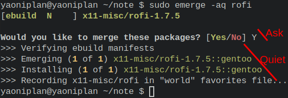

- Rofi #I3WM #Gentoo #Linux
	- `sudo emerge -aq x11-misc/rofi`
	- ***Notes***
		- `-a` # Ask
		- `-q` # Quiet
	- ***References***
		- 
		- `man emerge` # Search (by pressing "") "--ask" and "--quiet" in manual page emerge
- ---
- Brightness #I3WM #Gentoo #Linux
	- `sudo emerge --ask x11-apps/xbacklight`
	- `sudo vim ~/.config/i3/config`
		- ```
		  bindsym XF86MonBrightnessUp exec xbacklight -inc 10
		  bindsym XF86MonBrightnessDown exec xbacklight -dec 10
		  ```
	- ***Notes***
		- `sudo reboot` # Reboot the operating system finally
	- ***References***
		- 
		- [I3wm 配置思路 ｜ 千玄洞](https://zjuyk.gitlab.io/posts/i3wm-config/)
- ---
- Sound #Gentoo #Linux
	- `sudo emerge --ask app-portage/gentoolkit`
	- `sudo euse -E alsa`
	- `sudo emerge --ask --changed-use --deep @world`
	- `sudo emerge --ask media-sound/alsa-utils`
	- `sudo rc-update add alsasound boot`
	- `sudo gpasswd -a yaoniplan audio`
	- `alsamixer`
	- ***Notes***
		- **Compile kernel**
			- `cd /usr/src/linux`
			- `sudo make menuconfig`
			- `sudo make -j6`
			- `sudo make modules_install`
			- `sudo make install`
		- `sudo reboot` # Reboot the operating system finally
	- ***References***
		- [ALSA - Gentoo Wiki](https://wiki.gentoo.org/wiki/ALSA)
- ---
- Install google-chrome #Gentoo #Linux
	- `sudo vim /etc/portage/package.license`
		- ```
		  www-client/google-chrome google-chrome
		  ```
	- `sudo emerge --ask www-client/google-chrome`
	- ***Notes***
		- `www-client/google-chrome google-chrome` # Accept license if you want to install and use this software
	- ***References***
		- [Chrome - Gentoo Wiki](https://wiki.gentoo.org/wiki/Chrome)