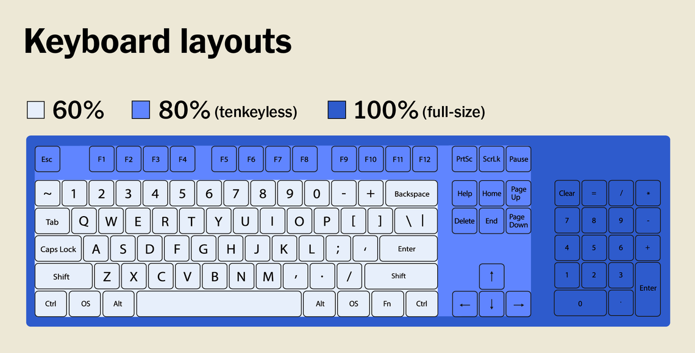
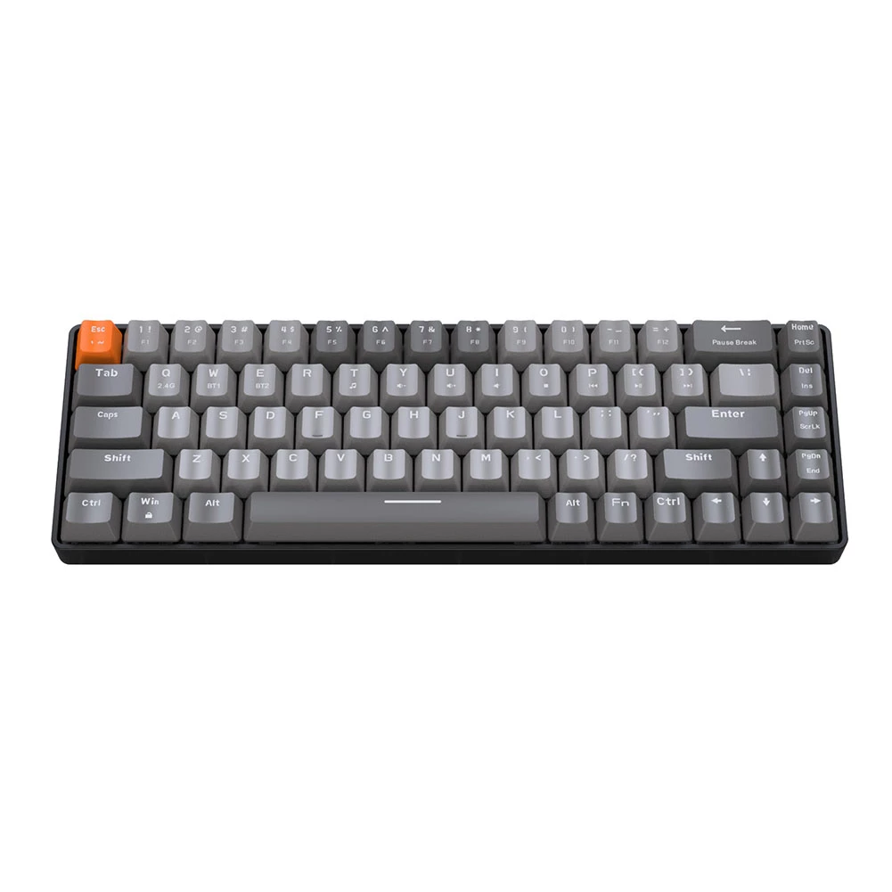

- ---
- #### Choose a keyboard #Computer
	- `Mechanical` `fast response` `PBT`
	- ***Notes***
		- **Form factor**
			- 100% (full-size) # Large and inefficient
		- **Ergonomic**
			- Align the "H" key with the center of the body
			- Flat and follow the angle of the thighs
		- **Wired and wireless**
		- **Arrow and function key**
		- **Switches**
		  <table><tbody><tr><td><strong>Name</strong></td><td><strong>Type</strong></td><td><strong>Actuation force</strong></td><td><strong>Noise</strong></td></tr><tr><td>Cherry MX Brown</td><td>Tactile</td><td>45 g</td><td>Average</td></tr><tr><td>Cherry MX Clear</td><td>Tactile</td><td>65 g</td><td>Average</td></tr><tr><td>Cherry MX Red</td><td>Linear</td><td>45 g</td><td>Low</td></tr><tr><td>Cherry MX Black</td><td>Linear</td><td>60 g</td><td>Low</td></tr><tr><td>Cherry MX Blue</td><td>Clicky</td><td>50 g</td><td>High</td></tr></tbody></table>
		- **Typing and programming**
			- Build quality
				- Plastic # Cheap, but will flex when you press too hard
				- Metal or higher-quality
			- Keycaps
				- ABS # Prone to wear and become smooth with heavy use
				- PBT # More durable
			- Programmability
				- Onboard # Customize certain keys
			- Removable cable
				- Removeable USB cable # Replace just the cable rather than the whole keyboard
	- ***References***
		- 
		- 
		- 
		- 
		- 
		- 
		- [How to Shop for a Mechanical Keyboard | Wirecutter](https://www.nytimes.com/wirecutter/blog/how-to-shop-for-a-mechanical-keyboard/)
		- [COMPUTER KEYBOARD DESIGN](https://ergo.human.cornell.edu/AHTutorials/ckd.htm)
		- []
- ---
- #### CopyQ installation #Application
	- `sudo emerge -aq --autounmask=y --autounmask-write x11-misc/copyq`
		- `sudo etc-update`
		- `-3` # Merge all files automatically
	- `sudo emerge -aq x11-misc/copyq`
- ---
- #### I am trying to replace "unorder list" syntax with "heading" syntax. #idea
	- because it has a link to share anyone.