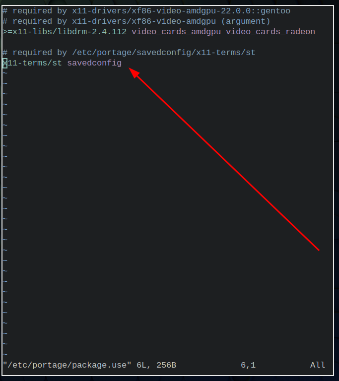

- ---
- #### Set USE flags for each package #Gentoo #Linux
	- `sudo vim /etc/portage/package.use`
	- ***References***
		- 
		- 
		- [/etc/portage/package.use - Gentoo Wiki](https://wiki.gentoo.org/wiki//etc/portage/package.use)
- ---
- #### Search in current line #Vim
	- `Shift+v` # Select current line
	- `/24` # Just like a normal search and press `Esc` key after the step
- ***Notes***
	- `Shift+v` # Press `Shift` follow by `v` in normal mode
	- `/24` # Replace `24` with what you want to search for
- ***References***
	- 
	- 
	- [macros - Vim - Find pattern on currently line ONLY - Stack Overflow](https://stackoverflow.com/questions/16572611/vim-find-pattern-on-currently-line-only)
- ---
- #### Install #ST ([[simple terminal]]) in [[Gentoo Linux]]
	- `sudo vim /etc/portage/package.use/zz-autounmask`
	  ```
	  # required by /etc/portage/savedconfig/x11-terms/st
	  x11-terms/st savedconfig
	  ```
	- `sudo emerge -aq x11-terms/st`
- ***Notes***
	- `x11-terms/st savedconfig` # Set the USE flag for the package
		- `x11-terms/st` # A package
		- `savedconfig` # A USE flag
			- To save custom configuration files
			- To avoid the file being lost
- ***References***
	- [st - Gentoo Wiki](https://wiki.gentoo.org/wiki/St)
- ---
- #### Solve error about module repository #Gentoo #Linux
	- `sudo emerge eselect-repository`
	- ***Notes***
		- **Error**
			- ```
			  yaoniplan@yaoniplan ~ $ eselect repository enable torbrowser
			  !!! Error: Can't load module repository
			  exiting
			  yaoniplan@yaoniplan ~ $
			  ```
	- ***References***
		- 
		- 
		- 
		- [swift-overlay/README.md at main · luliu/swift-overlay](https://github.com/luliu/swift-overlay/blob/main/README.md)