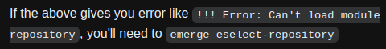

- #### Configure ST (simple terminal) #Gentoo #Linux
	- `sudo euse --enable savedconfig` # Enable **savedconfig** USE flag
	- `sudo USE="savedconfig" emerge -aq st` #
- ---
- #### Solve error about module repository #Gentoo #Linux
	- `sudo emerge eselect-repository`
	- ***Notes***
		- **Error**
			- ```
			  yaoniplan@yaoniplan ~ $ eselect repository enable torbrowser
			  !!! Error: Can't load module repository
			  exiting
			  yaoniplan@yaoniplan ~ $
			  ```
	- ***References***
		- 
		- 
		- 
		- [swift-overlay/README.md at main · luliu/swift-overlay](https://github.com/luliu/swift-overlay/blob/main/README.md)