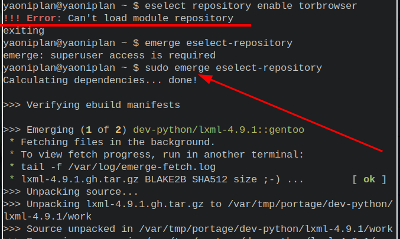

- Set fonts #ST #Gentoo #Linux
	- `sudo emerge -aq media-fonts/roboto` # Install font
	- `eselect fontconfig list` # List fontconfig
	- `sudo eselect fontconfig enable 41` # Select and enable fontconfig of 41
	- ***References***
		- [The 10 Best Free Font Websites for Free Fonts Online](https://www.makeuseof.com/tag/free-fonts-sites-where-find-them/)
- ---
- #### Set USE flags for each package #Gentoo #Linux
	- `sudo vim /etc/portage/package.use`
	- ***References***
		- 
		- 
		- [/etc/portage/package.use - Gentoo Wiki](https://wiki.gentoo.org/wiki//etc/portage/package.use)
- ---
- #### Search in current line #Vim
	- `Shift+v` # Select current line
	- `/24` # Just like a normal search and press `Esc` key after the step
	- ***Notes***
		- `Shift+v` # Press `Shift` follow by `v` in normal mode
		- `/24` # Replace `24` with what you want to search for
	- ***References***
		- 
		- 
		- [macros - Vim - Find pattern on currently line ONLY - Stack Overflow](https://stackoverflow.com/questions/16572611/vim-find-pattern-on-currently-line-only)
- ---
- #### Install and ST (simple terminal) #Gentoo #Linux
	- `sudo euse --enable savedconfig` # Enable **savedconfig** USE flag
	- `sudo vim /etc/portage/package.use` # Set Use flag for **x11-terms/st** package
		- ```
		  # required by /etc/portage/savedconfig/x11-terms/st
		  x11-terms/st savedconfig
		  ```
	- `sudo emerge -aq x11-terms/st` # Install it
	- `sudo vim /etc/portage/savedconfig/x11-terms/st-0.8.5` # Edit configuration
	- `sudo emerge -aq x11-terms/st` # Recompile st for the changes to take effect
	- ***Notes***
		- **Font and the size**
		  ```
		  static char *font = "source code pro:pixelsize=24:antialias=true:autohint=true";
		  ```
			- `source code pro` # Replace
- ---
- #### Solve error about module repository #Gentoo #Linux
	- `sudo emerge eselect-repository`
	- ***Notes***
		- **Error**
			- ```
			  yaoniplan@yaoniplan ~ $ eselect repository enable torbrowser
			  !!! Error: Can't load module repository
			  exiting
			  yaoniplan@yaoniplan ~ $
			  ```
	- ***References***
		- 
		- 
		- 
		- [swift-overlay/README.md at main · luliu/swift-overlay](https://github.com/luliu/swift-overlay/blob/main/README.md)