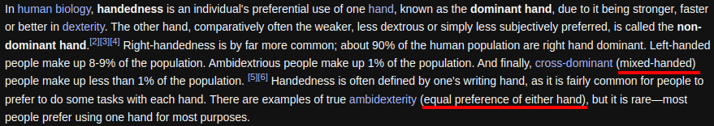

- ---
- #### I am trying to mix and not just handedness. #Idea
- ***References***
	- 
	- [Handedness - Wikipedia](https://en.wikipedia.org/wiki/Handedness)
- ---
- #### Chew food properly #Idea
	- Don't overload your spoon or fork
	- Chew with your mouth **closed**, with your tongue **moving** food **form side to side** and your jaw **rotating** slightly
	- Chew slow and steadily, counting to 32 with each bite
	- **Wait** until you have finished food in your mouth before drinking fluids
- ***Notes***
	- `overload your spoon` # It will fall off the sides
	- `32` # Just ensure the food in your mouth **loses** all of its **texture** before swallowing
	- `drinking fluids` # It will **slow** the digestive **process** by diluting enzymes in the body which break down food
- ***References***
	- 
	- [Is there a right way to chew your food?](https://www.tandaradental.com.au/are-you-paying-attention-to-how-you-eat-is-there-a-right-way-to-chew-your-food/)