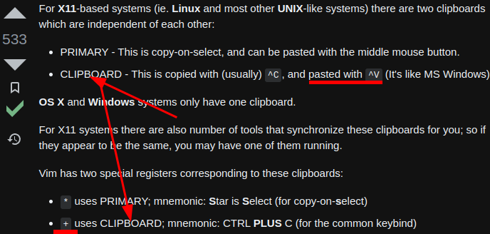

- ---
- The #Abbreviation for the [European Union](https://en.wikipedia.org/wiki/European_Union) is `EU`.
- ***Notes***
	- a union
	- 27 member states
	-
- ---
- #### Copy text from #Vim to external application without using mouse
	- `Shift v` # Select what you want to copy **before copying**
	- `"+y` # Copy text from Vim
	- `Ctrl v` # Paste text to external application (e.g. web browser, instant messaging, etc.)
- ***Notes***
	- `Shift v` # Means press `Shift` and `v` **together**
		- Use other commands (e.g. `j`, `k`, etc.) if you want to select more information
	- `"+y` # Means press `"`, `+` and `y` **one by one**
		- `y` # Stand for **yank** (in other editors is called **copy**)
	- `Ctrl v` # Means press `Ctrl` and `v` **together**
- ***References***
	- 
	- 
	- 
	- [How can I copy text to the system clipboard from Vim? - Vi and Vim Stack Exchange](https://vi.stackexchange.com/questions/84/how-can-i-copy-text-to-the-system-clipboard-from-vim)