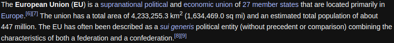
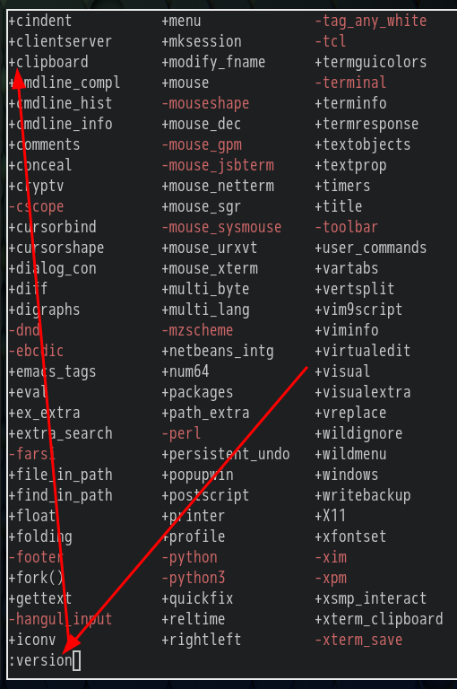

- #### Set a keyboard shortcut for the [[Google Chrome]] #extensions
	- `about:extensions/shortcuts` # Type it in your search bar
- ***Notes***
	- Usage of the [[Google Translate]] #extension
		- `Alt t` # Press *Alt* and *t* **together** to open the extension
		- `energized` # Replace it with what you want and type in the extension bar
		- `Tab` # Press the *Tab* key to select the section you want to select
			- `Shift Tab` # Select previous section
- ***References***
	- 
	- 
	- 
	- [How to Open Extensions With a Keyboard Shortcut in Any Browser](https://www.makeuseof.com/open-browser-extensions-keyboard-shortcut/)
- ---
- #### The #abbreviation of the **European Union** is **EU**.
- ***Notes***
	- Located in Europe mainly
	- A union
	- 27 member states
- ***References***
	- 
	- [European Union - Wikipedia](https://en.wikipedia.org/wiki/European_Union)
- ---
- #### Copy text from #Vim to external application without using mouse
	- `Shift v` # Select what you want to copy **before copying**
	- `"+y` # Copy text from Vim
	- `Ctrl v` # Paste text to external application (e.g. *web browser*, *instant messaging*, etc.)
- ***Notes***
	- `Shift v` # Means pressing *Shift* and *v* **together**
		- Use other commands (e.g. *j*, *k*, etc.) if you want to select more information
	- `"+y` # Means pressing *"*, *+* and *y* **one by one**
		- `y` # Stand for **yank** (in other editors is called **copy**)
	- `Ctrl v` # Means pressing *Ctrl* and *v* **together**
	- If your clipboard is not working
		- `:version` # Check the clipboard feature in #Vim
		  
		- `sudo vim /etc/portage/package.use/zz-autounmask` # Edit and Add the USE flag to enable the clipboard feature
		  ```
		  # required by app-editors/vim
		  app-editors/vim X
		  ```
		  
		- `sudo emerge -q app-editors/vim` # Recompile it to enable the USE flag
- ***References***
	- 
	- 
	- 
	- [How can I copy text to the system clipboard from Vim? - Vi and Vim Stack Exchange](https://vi.stackexchange.com/questions/84/how-can-i-copy-text-to-the-system-clipboard-from-vim)
	- [Vim - Gentoo Wiki](https://wiki.gentoo.org/wiki/Vim)