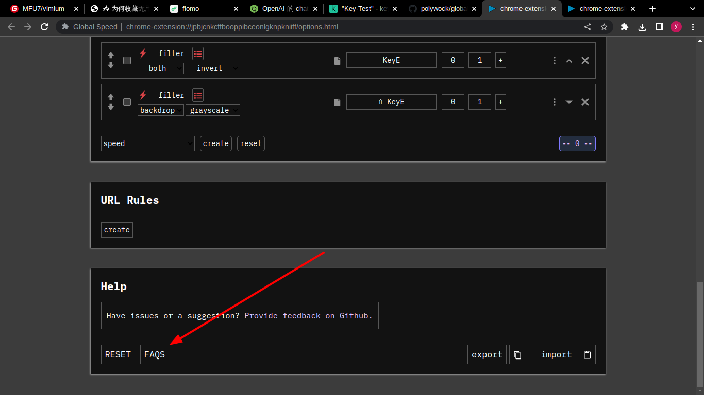
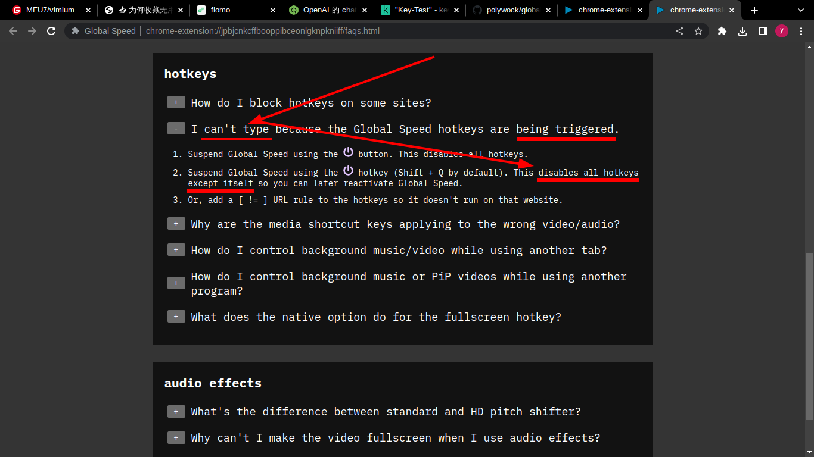

- #### Disable all hotkeys except itself for the [[Global Speed]] #Extension
	- `Shift q` # Press the *Shift* key and *q* key together
- ***Notes***
	- `except itself` # This means enabling the hotkey (*Shift q*) only
	- `Global Speed` # A [[Google Chrome]] #Extension to set the speed of web pages
	- `Shift q` # To avoid hotkeys conflicts with other extension(e.g. #Vimium)
- ***References***
	- 
	- 
	- [polywock/globalSpeed: Web extension to set a default speed for video and audio](https://github.com/polywock/globalSpeed)
- ---
- #### Stop forgetting to breathe #Idea
	- Exhale on the effort
- ***References***
	- 
	- [Don't Forget to Breathe - YouTube](https://www.youtube.com/watch?v=LxD3e-K9vug)