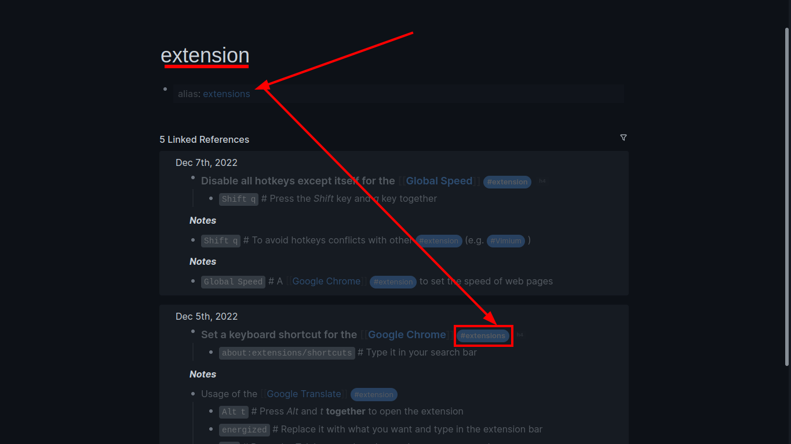
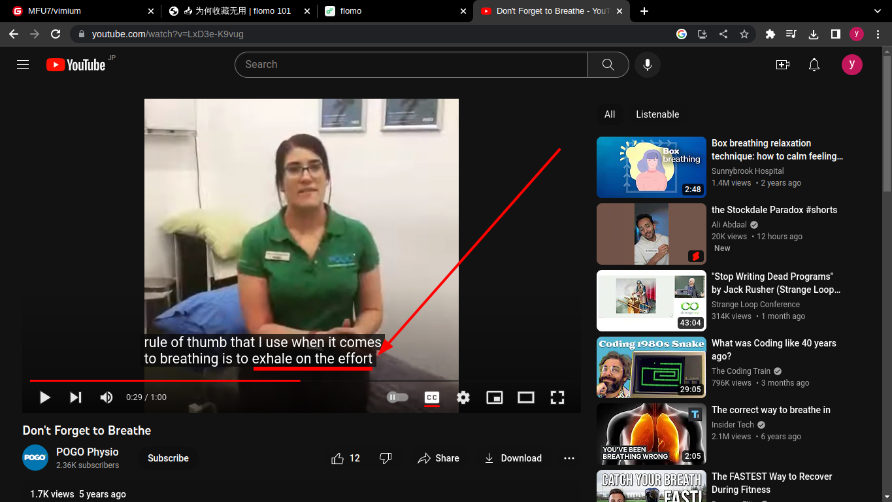

- Set some aliases for pages in #Logseq
	- Type this code (`alias:: extensions`) on the first block of the page and replace *extensions* with your alias
- ***Notes***
	- What is alias?
	- This means merging pages with the same meaning.
- ***References***
	- 
	- 
	- [The Ultimate Guide to Aliases in Logseq | Aryan Sawhney](https://aryansawhney.com/pages/the-ultimate-guide-to-aliases-in-logseq/)
- ---
- #### Disable all hotkeys except itself for the [[Global Speed]] #extension
	- `Shift q` # Press the *Shift* key and *q* key together
- ***Notes***
	- `except itself` # This means enabling the hotkey (*Shift q*) only
	- `Global Speed` # A [[Google Chrome]] #extension to set the speed of web pages
	- `Shift q` # To avoid hotkeys conflicts with other #extension (e.g. #Vimium )
- ***References***
	- 
	- 
	- [polywock/globalSpeed: Web extension to set a default speed for video and audio](https://github.com/polywock/globalSpeed)
- ---
- #### Stop forgetting to breathe #Idea
	- Exhale on the effort
- ***References***
	- 
	- [Don't Forget to Breathe - YouTube](https://www.youtube.com/watch?v=LxD3e-K9vug)