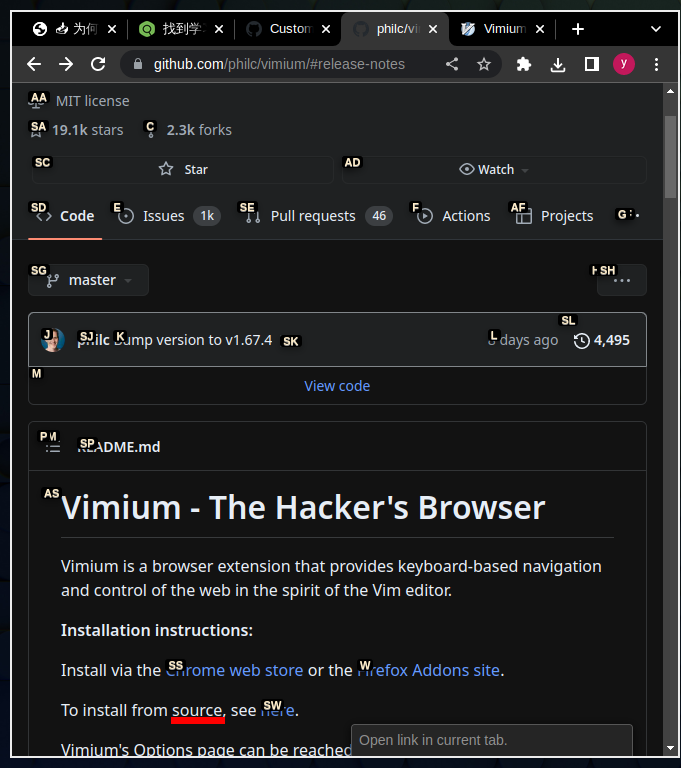

- ---
- #### Set #CSS for #Vimium #UI permanently
	- `vim vimium-1.67.4/content_scripts/vimium.css` # Edit the file after downloading form [source code](https://github.com/philc/vimium/tags)
		- ```CSS
		  div.internalVimiumHintMarker {
		    position: absolute;
		    display: block;
		    top: -1px;
		    left: -1px;
		    white-space: nowrap;
		    overflow: hidden;
		    font-size: 11px;
		    padding: 1px 3px 0px 3px;
		    background: linear-gradient(to bottom, #000000 100%,#FFC542 100%);
		    border: solid 0px #C38A22;
		    border-radius: 3px;
		    box-shadow: 0px 3px 7px 0px rgba(0, 0, 0, 0.3);
		  }
		  ```
		- 
	- Edit `CSS for Vimium UI` options of #extension
		- ```CSS
		  div > .vimiumHintMarker {
		  /* linkhint boxes */
		  background: -webkit-gradient(linear, left top, left bottom, color-stop(100%,#000000),
		    color-stop(100%,#FFC542));
		  border: 0px solid #E3BE23;
		  }
		  
		  div > .vimiumHintMarker span {
		  /* linkhint text */
		  color: black;
		  font-weight: bold;
		  font-size: 12px;
		  }
		  
		  div > .vimiumHintMarker > .matchingCharacter {
		  }
		  ```
		- 
- ***Notes***
	- Theses **two places** (`vimium.css` and `CSS for Vimium UI`) must be changed, otherwise it will not work sometimes.
- ***References***
	- 
	- 
	- [Custom CSS for Link Hints inside iFrames seems to not be working correctly again · Issue #3418 · philc/vimium](https://github.com/philc/vimium/issues/3418)